Final Report
================
JB Lim
2020-03-16

``` r
library(tidyverse)
library(lubridate)
library(sf)

un_voting_file <-
  here::here("c01-own/data/un_voting.rds")

country_border_data_democracy_file <-
  here::here("c01-own/data/country_border_data_democracy.rds")

# Voting Codes
vote_code <-
  c(1, 2, 3)

# Map Aesthetics
MAP_COLORS <- RColorBrewer::brewer.pal(n = 9, name = "PuBu")
MAP_NA_COLOR <- "grey75"
```

**Objective**

The report will be examining the status of the United States’ hegemonic
leadership in the post Cold-War era (1992-2018) by assessing the voting
behaviors of other nations in the United Nations General Assembly.

**Background Context**

  - The following report focues on the **“United Nations General
    Assembly Voting Data”** posted on the *Harvard Dataverse.* The
    dataset examines all the “roll-call votes in the UN General
    Assembly” from 1946 to 2018.

  - The [code
    book](https://dataverse.harvard.edu/file.xhtml?persistentId=doi:10.7910/DVN/LEJUQZ/IPRJ61&version=21.0)
    of the dataset articulates the variables of the raw UNGA dataset.
    Notable variables include Vote Choice (with 1 as Yes, 2 as Abstain,
    3 as No, 8 as Absent, 9 as Not a member), Country Code, Year of
    Vote, Votes identified as important by U.S. State Department report
    and Issue Codes.

  - Issue Codes include: Votes relating to the Palestinian Conflict,
    Nuclear weapons and nuclear material, Arms control and disarmanent,
    Colonialism, Human Rights, Economic Development.

**Part 1: Wrangling the UN voting data**

``` r
# Reading in the data files.
un_voting <-  
  un_voting_file %>%
  read_rds() %>%
  mutate_at(vars(country), ~ str_to_lower(.))

country_info <-
  country_border_data_democracy_file %>%
  read_rds()
```

  - First, let’s explore the data quality of the un voting dataset
    provided by Professor Erik Voten.

<!-- end list -->

``` r
un_voting %>%
  summarize_all(~ sum(is.na(.))) %>%
  glimpse()
```

    ## Observations: 1
    ## Variables: 21
    ## $ rcid          <int> 0
    ## $ ccode         <int> 0
    ## $ member        <int> 331385
    ## $ vote          <int> 0
    ## $ country       <int> 7190
    ## $ countryname   <int> 0
    ## $ year          <int> 0
    ## $ session       <int> 0
    ## $ abstain       <int> 2997
    ## $ yes           <int> 200
    ## $ no            <int> 17374
    ## $ importantvote <int> 102050
    ## $ date          <int> 0
    ## $ unres         <int> 31345
    ## $ descr         <int> 200
    ## $ me            <int> 0
    ## $ nu            <int> 0
    ## $ di            <int> 0
    ## $ hr            <int> 0
    ## $ co            <int> 0
    ## $ ec            <int> 0

  - We notice that “member” has the most number of NAs. As nations
    joined the UN in different times since its establishment in 1945,
    any observation with NA values for “member” should be dropped.

<!-- end list -->

``` r
un_voting <-
  un_voting %>%
  drop_na(member)
```

  - Second, we notice that Czech Republic and Czechoslovakia constitute
    the nations with member code “9” (not a member). In particular,
    Czech Republic joined the United Nations in 1993 with the
    dissolution of Czechoslovakia into Czech and Slovakia. Thus, the
    data for Czech Republic until 1992 has the member code “9” and that
    of Czechoslovakia for 1993 onward has member code “9”. We would be
    dropping such data.

<!-- end list -->

``` r
un_voting %>%
  filter(member == 9) %>%
  glimpse() %>%
  count(countryname, year)
```

    ## Observations: 4,704
    ## Variables: 21
    ## $ rcid          <int> 3, 4, 5, 6, 7, 8, 9, 10, 11, 12, 13, 14, 15, 16, 17, 18…
    ## $ ccode         <int> 316, 316, 316, 316, 316, 316, 316, 316, 316, 316, 316, …
    ## $ member        <int> 9, 9, 9, 9, 9, 9, 9, 9, 9, 9, 9, 9, 9, 9, 9, 9, 9, 9, 9…
    ## $ vote          <int> 9, 9, 9, 9, 9, 9, 9, 9, 9, 9, 9, 9, 9, 9, 9, 9, 9, 9, 9…
    ## $ country       <chr> "cze", "cze", "cze", "cze", "cze", "cze", "cze", "cze",…
    ## $ countryname   <chr> "Czech Republic", "Czech Republic", "Czech Republic", "…
    ## $ year          <int> 1946, 1946, 1946, 1946, 1946, 1946, 1946, 1946, 1946, 1…
    ## $ session       <int> 1, 1, 1, 1, 1, 1, 1, 1, 1, 1, 1, 1, 1, 1, 1, 1, 1, 1, 1…
    ## $ abstain       <int> 4, 8, 1, 10, 0, 2, 2, 0, 0, 3, 2, 5, 6, 7, 2, 9, 11, 1,…
    ## $ yes           <int> 29, 9, 28, 12, 25, 38, 45, 46, 41, 21, 10, 7, 10, 7, 27…
    ## $ no            <int> 18, 34, 22, 27, 18, 1, 0, 2, 0, 22, 31, 30, 26, 34, 19,…
    ## $ importantvote <lgl> FALSE, FALSE, FALSE, FALSE, FALSE, FALSE, FALSE, FALSE,…
    ## $ date          <date> 1946-01-01, 1946-01-02, 1946-01-04, 1946-01-04, 1946-0…
    ## $ unres         <chr> "R/1/66", "R/1/79", "R/1/98", "R/1/107", "R/1/295", "R/…
    ## $ descr         <chr> "TO ADOPT A CUBAN AMENDMENT TO THE UK PROPOSAL REFERRIN…
    ## $ me            <lgl> FALSE, FALSE, FALSE, FALSE, FALSE, FALSE, FALSE, FALSE,…
    ## $ nu            <lgl> FALSE, FALSE, FALSE, FALSE, FALSE, FALSE, FALSE, FALSE,…
    ## $ di            <lgl> FALSE, FALSE, FALSE, FALSE, FALSE, FALSE, FALSE, FALSE,…
    ## $ hr            <lgl> FALSE, FALSE, FALSE, TRUE, FALSE, FALSE, FALSE, FALSE, …
    ## $ co            <lgl> FALSE, FALSE, FALSE, FALSE, FALSE, FALSE, FALSE, FALSE,…
    ## $ ec            <lgl> FALSE, FALSE, FALSE, FALSE, FALSE, TRUE, FALSE, FALSE, …

    ## # A tibble: 60 x 3
    ##    countryname     year     n
    ##    <chr>          <int> <int>
    ##  1 Czech Republic  1946    43
    ##  2 Czech Republic  1947    38
    ##  3 Czech Republic  1948    64
    ##  4 Czech Republic  1949   104
    ##  5 Czech Republic  1950    50
    ##  6 Czech Republic  1951     7
    ##  7 Czech Republic  1952    70
    ##  8 Czech Republic  1953    26
    ##  9 Czech Republic  1954    31
    ## 10 Czech Republic  1955    37
    ## # … with 50 more rows

``` r
un_voting <-
  un_voting %>%
  filter(member != 9)
```

  - Let’s also access whether there are any problems with Slovakia.

<!-- end list -->

``` r
un_voting %>%
  filter(countryname == "Slovakia") %>%
  count(vote)
```

    ## # A tibble: 5 x 2
    ##    vote     n
    ##   <int> <int>
    ## 1     1  1191
    ## 2     2   410
    ## 3     3   290
    ## 4     8    15
    ## 5     9    74

``` r
un_voting %>%
  filter(countryname == "Slovakia", vote == 9) %>%
  distinct(year)
```

    ## # A tibble: 1 x 1
    ##    year
    ##   <int>
    ## 1  1992

  - We see that Slovakia had 74 votes under “not a member.” Slovakia
    became a member of the United Nations in 1993. Thus, we see how the
    votes from 1992 for Slovakia have been counted as “not a member” and
    instead registered under Czechoslovakia. We drop this value as well.

<!-- end list -->

``` r
un_voting <-
  un_voting %>%
  filter(countryname != "Slovakia" | vote != 9)
```

  - Let’s also access in, greater depth, whether other nations face
    similar issues to Slovakia in terms of their vote choice record.

<!-- end list -->

``` r
vote_nine <-
  un_voting %>%
  left_join(
    country_info %>% 
      select(un_member_date, iso),
    by = c("country" = "iso")
  ) %>%
  filter(vote == 9) %>%
  count(countryname, year, un_member_date)

vote_nine %>%
  count(year == un_member_date | year == (un_member_date - 1))
```

    ## # A tibble: 3 x 2
    ##   `year == un_member_date | year == (un_member_date - 1)`     n
    ##   <lgl>                                                   <int>
    ## 1 FALSE                                                       3
    ## 2 TRUE                                                       70
    ## 3 NA                                                          8

``` r
vote_nine %>%
  filter(is.na(un_member_date))
```

    ## # A tibble: 8 x 4
    ##   countryname                year un_member_date     n
    ##   <chr>                     <int>          <dbl> <int>
    ## 1 Taiwan, Province of China  1971             NA   112
    ## 2 Yemen Arab Republic        1947             NA     6
    ## 3 Yemen People's Republic    1966             NA     1
    ## 4 Yemen People's Republic    1967             NA    26
    ## 5 Yugoslavia                 1992             NA    73
    ## 6 Yugoslavia                 1993             NA     1
    ## 7 Yugoslavia                 2000             NA     3
    ## 8 Zanzibar                   1963             NA    15

``` r
vote_nine %>%
  filter(year != un_member_date, year != (un_member_date - 1))
```

    ## # A tibble: 3 x 4
    ##   countryname  year un_member_date     n
    ##   <chr>       <int>          <dbl> <int>
    ## 1 China        1971           1945     5
    ## 2 Mauritius    1966           1968     1
    ## 3 Yemen        2010           1947     1

  - We notice that most “9” voting codes for most nations come from one
    or two specific years. Out of 81 such cases 70 (86.4197531 %), the
    year with “9” voting code matched the membership year (or the
    preceding year). For instance, in the case of Sweden, the nation was
    admitted in November 19, 1946. Hence, the nation was recorded as “9”
    for voting in resolutions prior to that date in the same year. We
    should hence be dropping these values.

  - The remaining 11 cases mainly come from nations that dissolved,
    merged or transferred their membership status since the
    establishment of the 1945. Indeed, they include China (previously
    held by Taiwan), Yemen (North Yemen, South Yemen), Zanzibar and
    Yugoslavia. These “edge” cases will be covered below in greater
    depth. For now, we drop these value for the similar logic as above.

<!-- end list -->

``` r
un_voting <-
  un_voting %>%
  filter(vote != 9)
```

  - Finally, aside from Czechoslovakia, we notice that seven countries
    have been members of the United Nations and currently are not part
    of the United Nations. The cases can be divided up as below and we
    check if there are any discrepencies in country names resulting from
    changing membership status or dissolution of states.

<!-- end list -->

``` r
# Full list of countries
names <-
  un_voting %>%
  distinct(countryname, country)

names %>%
  anti_join(country_info, by = c("country" = "iso")) %>%
  pull(countryname)
```

    ## [1] "Czechoslovakia"              "Yugoslavia"                 
    ## [3] "Taiwan, Province of China"   "Yemen Arab Republic"        
    ## [5] "Zanzibar"                    "Yemen People's Republic"    
    ## [7] "Federal Republic of Germany" "German Democratic Republic" 
    ## [9] "Tuvalu"

1.  Taiwan lost its status in the United Nations in 1971. The People’s
    Republic of China replaced Taiwan’s seat.

2.  Yugoslavia was a member of the United Nations from 1945 to 1992 when
    it disintegrated into Croatia, Slovenia, Bosnia and Herzegovina, and
    Serbia and Montenegro (called Federal Republic of Yugoslavia until
    2003). Yugoslavia “re-joined” the United Nations in 2000 with the
    entry of “Serbia and Montenegro” as one federation of state.
    Starting 2006, the seat was transferred to Serbia after Montenegro’s
    independence from Serbia.

3.  Yemen Arab Republic (North Yemen) and Yemen People’s Republic (South
    Yemen) united in 1990 to form the current Republic of Yemen.

4.  Similarly, the German Democratic Republic (East Germany) acceded to
    the Federal Republic of Germany (West Germany) in 1990.

5.  Zanzibar, as a semi-autonomous region of Tanzania, joined the UN in
    1963, but soon after merged with the United Republic of Tanganyika
    to form the United Republic of Tanzania on 1964.

Given these information, let’s check to see if all the data (including
country name corresponding to correct years) are updated and accurate.

``` r
# Taiwan
un_voting %>%
  filter(countryname == "Taiwan, Province of China", year > 1971) %>% 
  count() %>%
  pull()
```

    ## [1] 0

``` r
# Zanzibar
un_voting %>%
  filter(countryname == "Zanzibar", year != 1963) %>%
  count() %>%
  pull()
```

    ## [1] 0

  - As shown above, the cases for Taiwan (\#1) and Zanzibar(\#5) are
    relatively straightforward and the dataset has accurate information
    for the two states.

<!-- end list -->

``` r
# Yugoslavia
un_voting %>%
  filter(countryname == "Yugoslavia", year > 1991) %>% 
  count(year)
```

    ## # A tibble: 19 x 2
    ##     year     n
    ##    <int> <int>
    ##  1  1992     2
    ##  2  2000    63
    ##  3  2001    67
    ##  4  2002    73
    ##  5  2003    74
    ##  6  2004    72
    ##  7  2005    74
    ##  8  2006    87
    ##  9  2007    77
    ## 10  2008    76
    ## 11  2009    65
    ## 12  2010    66
    ## 13  2011    68
    ## 14  2012    70
    ## 15  2013    60
    ## 16  2014    80
    ## 17  2015    78
    ## 18  2016    75
    ## 19  2017    94

``` r
# Serbia
un_voting %>%
  filter(countryname == "Serbia", year > 1999) %>% 
  count(year, country)
```

    ## # A tibble: 1 x 3
    ##    year country     n
    ##   <int> <chr>   <int>
    ## 1  2018 srb        95

``` r
# Montenegro
un_voting %>%
  filter(countryname == "Montenegro", year > 1999) %>% 
  count(year)
```

    ## # A tibble: 13 x 2
    ##     year     n
    ##    <int> <int>
    ##  1  2006    85
    ##  2  2007    77
    ##  3  2008    76
    ##  4  2009    65
    ##  5  2010    66
    ##  6  2011    68
    ##  7  2012    70
    ##  8  2013    60
    ##  9  2014    80
    ## 10  2015    78
    ## 11  2016    75
    ## 12  2017    94
    ## 13  2018    95

  - For Yugoslavia (\#2), we notice how the dataset did not change its
    name to “Serbia” starting 2000. Specifically, while Montenegro was
    accurately named starting the year “2006” when it declared
    independence from Serbia, the data for the name “Serbia” only begins
    in 2018. Hence, we should rename Yugoslavia starting the year 2000
    to “Serbia” to reflect these changes.

<!-- end list -->

``` r
# rename
un_voting <-
  un_voting %>%
  mutate(
    country = if_else(country == "yug" & year > 1999, "srb", country),
    countryname = 
      if_else(countryname == "Yugoslavia" & year > 1999, "Serbia", countryname)
  )
```

  - Let’s finally check the data for the Yemens (\#3) and Germanys
    (\#4).

<!-- end list -->

``` r
# Yemen
un_voting %>%
  filter(countryname == "Yemen") %>%
  count(countryname, year)
```

    ## # A tibble: 28 x 3
    ##    countryname  year     n
    ##    <chr>       <int> <int>
    ##  1 Yemen        1991    74
    ##  2 Yemen        1992    75
    ##  3 Yemen        1993    65
    ##  4 Yemen        1994    68
    ##  5 Yemen        1995    79
    ##  6 Yemen        1996    76
    ##  7 Yemen        1997    70
    ##  8 Yemen        1998    62
    ##  9 Yemen        1999    68
    ## 10 Yemen        2000    67
    ## # … with 18 more rows

``` r
# Germany
un_voting %>%
  filter(countryname == "Germany") %>%
  count(countryname, year)
```

    ## # A tibble: 29 x 3
    ##    countryname  year     n
    ##    <chr>       <int> <int>
    ##  1 Germany      1990    86
    ##  2 Germany      1991    74
    ##  3 Germany      1992    75
    ##  4 Germany      1993    65
    ##  5 Germany      1994    68
    ##  6 Germany      1995    79
    ##  7 Germany      1996    76
    ##  8 Germany      1997    70
    ##  9 Germany      1998    62
    ## 10 Germany      1999    68
    ## # … with 19 more rows

  - We can confirm that the names are merged to their current names
    staring the 1991 and 1990 respectively. Also, we should be aware of
    these “edge” cases when working with the data in the next part.

**Note: Tuvalu**

  - Tuvalu is a member of the United Nations. However, we were unable to
    include Tuvalu for “boundaries or information” due to its absence in
    our original “Natural Earth” dataset.

**Part 2: Examining the United States’ hegemonic leadership in the post
Cold-War era (1992-2018)**

**Notes**

  - As illustrated above, I wrangled the UN voting dataset to account
    for transitions and dissolutions in certain states such as
    Yugoslavia or Czechoslovakia.

  - The country information file contains the boundary and relevant
    information (from Natural Earth) for 192 UN member states. The
    information dataset also includes While the United Nations has 193
    member states, the information dataset provided excludes Tuvalu due
    to its absence from the original “Natural Earth” dataset. Both
    datasets can be found in the Data Box
    <https://stanford.app.box.com/folder/104837039459>.

  - Finally, the information dataset includes additional facts on the
    status of democracy in 2019 (imported from “Freedom in the World”)
    and UN Membership status from the Gapminder dataset covered in the
    Stanford Data Challenge Lab course.

<!-- end list -->

``` r
path_name <-
  here::here("c01-own/data/un_voting_wrangled.rds")

un_voting_file <-
  here::here("c01-own/data/un_voting_wrangled.rds")

country_information_file <-
  here::here("c01-own/data/country_border_data_democracy.rds")

# UN voting data
un_voting <-  
  un_voting_file %>%
  read_rds() %>%
  mutate(country = str_to_lower(country))

# Country Information
country_info <-
  country_information_file %>%
  read_rds()
```

  - We will be dropping “Czechoslovakia” and “Yugoslavia” which ceased
    to exist in 1992 and 1993 respectively (only represents 77 out of
    862969 observations) from the UN General Assembly Dataset.

  - Also, following the codebook names, we will rename the following
    variables: “country” to “iso”, “me” to “palestine”, “nu” to
    “nuclear\_weapons”, “di” to “disarmament”, “hr” to
    “human\_rights”, “co” to “colonialism”, “ec” to “economic\_dev”

<!-- end list -->

``` r
# Combining the two data sets
post_cold_war <-
  un_voting %>%
  filter(year > 1991) %>%
  left_join(
    country_info %>% select(-country),
    by = c("country" = "iso")
  ) %>%
  drop_na(electoral_democracy) %>%
  select(
    rcid,
    vote,
    iso = country,
    countryname, 
    year,
    importantvote,
    palestine = me,
    nuclear_weapons = nu,
    disarmament = di,
    human_rights = hr,
    colonialism = co,
    economic_dev = ec,
    pop_est:electoral_democracy
  )
```

**2-1. Calculating Alignment**

Now, we calculate the “alignment” of votes between the United States and
other UN member states for all the unique resolutions since 1992. The
rcid code uniquely identifies each distinct resolution from 1992 to
2018. The variable vote indicates the countries vote for the specific
resolution. For now, let’s focus on the votes “Yes”, “No” and “Abstain.”
Refer to the documentation on the dataset to understand the numeric
codes for each corresponding vote.

To do this, we would need the following pieces of information: 1.
Retrieve information on the United States’ (or any desired nations’)
voting record for every resolution (rcid). 2. Compare that with other
nations through grouping by each rcid. 3. Calculating the difference in
votes using absolute values and providing appropriate labels.

``` r
target_nation <- function(x)
  post_cold_war %>%
  group_by(rcid) %>%
  filter(iso == x) %>%
  select(rcid, vote) %>%
  rename_at(vars(vote), ~ str_c(., "_", x)) %>%
  ungroup()
```

We also build a function that takes in a tibble of target nation votes
and returns a tibble with a new variable “difference.” The “difference”
variable should be factorized from numeric values into categorical
values(“Agreed”, “Abstained”, “Disagreed”).

``` r
alignment <- function(df, vars, target_code)
  post_cold_war %>%
  left_join(df, by = "rcid") %>%
  filter(
    iso != target_code,
    vote %in% vote_code,
    {{vars}} %in% vote_code
  ) %>%
  mutate(
    difference = abs(vote - {{vars}}),
    difference = 
      factor(
        difference,
        labels = 
          c("Agreed", "Abstained", "Disagreed")
      )
  )
```

Using the two functions above, we calculate the voting alignment trend
for the United States from 1992 to 2018.

``` r
us_alignment <-
  alignment(target_nation("usa"), vote_usa, "usa") %>%
  select(-vote_usa)
```

We do the same for China.

``` r
china_alignment <-
  alignment(target_nation("chn"), vote_chn, "chn") %>%
  select(-vote_chn)
```

**2-2. Basic Distribution of alignment patterns for U.S. and China**

``` r
difference_bar <- function(df)
  df %>%
  ggplot(aes(difference)) +
  geom_bar(width = 0.5) +
  theme_minimal()

difference_bar(us_alignment) +
  scale_y_continuous(
    breaks = scales::breaks_width(50000)
  ) +
  labs(
    title = 
      "Number of disagreements with U.S. and U.N. member states \nmore than doubles that of agreement",
    x = NULL,
    y = "Count of UNGA votes between 1992-2018",
    caption = "Source: UNGA Voting Database"
  )
```

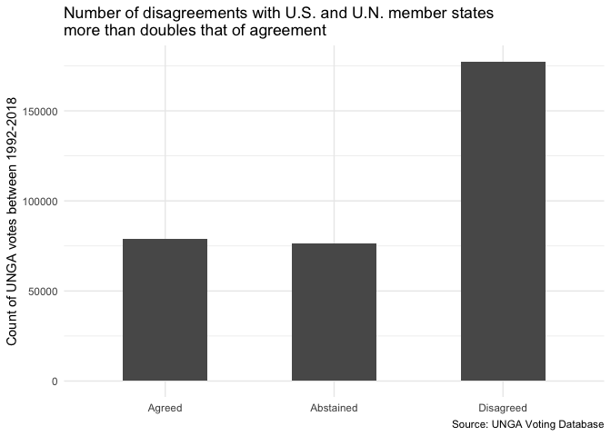<!-- -->

``` r
difference_bar(china_alignment) +
  scale_y_continuous(
    breaks = scales::breaks_width(50000)
  ) +
  labs(
    title = 
      "Number of agreements between China and U.N. member states \n was about ten times that of disagreement",
    x = NULL,
    y = "Count of UNGA votes between 1992-2018",
    caption = "Source: UNGA Voting Database"
  )
```

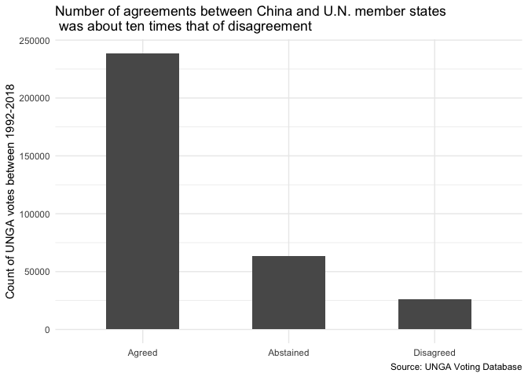<!-- -->

  - We notice how the number of disagreements with the United States and
    the United Nations member states more than doubles that of
    agreement. In the case of China, we observe how the number of
    agreements between China and U.N. member states was about ten times
    that of disagreement. Such a stark difference underscores how, among
    the United Nations member states, China is often viewed more
    favorably than the United States.

<!-- end list -->

``` r
difference_bar_issue <- function(df)
  df %>%
  group_by(difference) %>%
  summarize_at(
    vars(
      palestine,
      nuclear_weapons,
      colonialism,
      economic_dev,
      human_rights,
      disarmament
    ),
    sum
  ) %>%
  pivot_longer(
    cols = 
      c(
        palestine,
        nuclear_weapons,
        colonialism,
        economic_dev,
        human_rights,
        disarmament
      ),
    names_to = "name",
    values_to = "vote"
  ) %>% 
  ggplot(aes(x = name, y = vote, fill = difference)) +
  geom_col(position = "dodge", width = 0.6) +
  scale_x_discrete(
    labels = 
      c(
        "Colonialism",
        "Disarmament",
        "Economic Development",
        "Human Rights",
        "Nuclear Weapons",
        "Palestine"
      )
  ) +
  scale_fill_manual(
    limits = c("Agreed", "Abstained", "Disagreed"),
    values = c("Blue", "yellow", "Red")
  ) +
  theme_minimal() +
  theme(
    axis.text.x = element_text(angle = -90)
  )

difference_bar_issue(us_alignment) +
  scale_y_continuous(
    breaks = scales::breaks_width(25000)
  ) +
  labs(
    title = 
      "Issues related to Palestine elicit most disagreements for U.S.",
    x = NULL,
    y = "Count of UNGA votes between 1992-2018",
    fill = NULL,
    caption = "Source: UNGA Voting Database"
  )
```

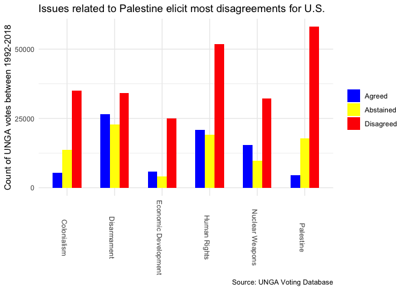<!-- -->

``` r
difference_bar_issue(china_alignment) +
  scale_y_continuous(
    breaks = scales::breaks_width(25000)
  ) +
  labs(
    title = 
      "Issues related to Palestine elicit most agreement for China",
    x = NULL,
    y = "Count of UNGA votes between 1992-2018",
    fill = NULL,
    caption = "Source: UNGA Voting Database"
  )
```

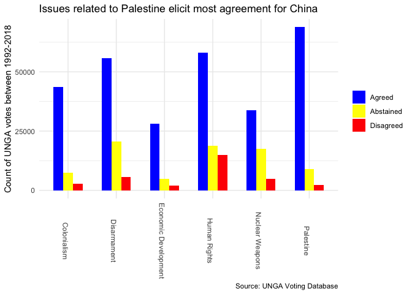<!-- -->

  - The United States had the most disagreements in issues related to
    Palestine and Human Rights. While the United States had some
    aligning votes for human rights (perhaps stemming from Western
    Europe, North American allies with similar human rights standards),
    it had almost no support in the issue of Palestine. The disagreement
    with regards to Palestine was nearly ten times larger than that of
    agreement: the small agreement votes primarily represent that of
    Israel.

  - Another noteworthy pattern is the difference distribution in
    “Disarmament.” Unlike other issues, the agreement number nearly
    equaled that of disagreed and abstained. This demonstrates how the
    U.S. stance on disarmament may have a relatively stronger
    support-base compared to that of Palestine, Colonialism, or Human
    Rights.

  - China, on the other hand, performed very well across all issues. The
    nation’s largest disagreement issue was human rights, which may
    reflect the Western democracies incompatible human rights standards
    with China. Nonetheless, China still had nearly four times alignment
    than disagreement in human rights, signaling the non-West’s support
    for China amidst the traditionally Western-centered human rights
    discussion.

**2-3. Distribution of alignment patterns for U.S. and China**

  - Given that we understand the basic differences in alignment pattern,
    let’s understand what regions align with the two superpowers the
    most and least in the United Naitons.

<!-- end list -->

``` r
colors <- function(n) {
  hues <- seq(15, 375, length.out = n + 1)
  hcl(h = hues, c = 100, l = 65)[1:n]
}
country_colors <- 
  colors(n_distinct(post_cold_war$region_wb)) %>% 
  set_names(unique(post_cold_war$region_wb) %>% sort())
```

``` r
disagreement_region <- function(df)
  df %>%
  count(year, region_wb, difference) %>%
  pivot_wider(
    names_from = difference,
    values_from = n
  ) %>%
  rename_all(str_to_lower) %>%
  group_by(year, region_wb) %>%
  summarize(
    prop_agree = 
      agreed / sum(agreed, abstained, disagreed)
  ) %>%
  ungroup() %>%
  ggplot(
    aes(year, prop_agree, color = fct_reorder(region_wb, prop_agree))
  ) +
  geom_line() +
  geom_point() +
  ggrepel::geom_text_repel(
    aes(label = region_wb),
    data = 
      . %>% group_by(year, region_wb) %>% filter(year == 2018),
    nudge_x = 10
  ) +
  scale_x_continuous(
    breaks = seq(1992, 2020, 4),
    minor_breaks = NULL,
    limits = c(1992, 2030)
  ) +
  scale_y_continuous(labels = scales::percent_format(accuracy = 1)) +
  scale_color_manual(
    values = country_colors
  ) +
  coord_fixed(ratio = 32.5) +
  guides(color = "none") +
  theme_minimal()

disagreement_region(us_alignment) +
  labs(
    title = "Alignement rate with the U.S. by Region (1992-2018)",
    x = "Year",
    y = "Percentage of votes in agreement with the U.S.",
    color = "Subregion",
    caption = "Source: UNGA Voting Database"
  )
```

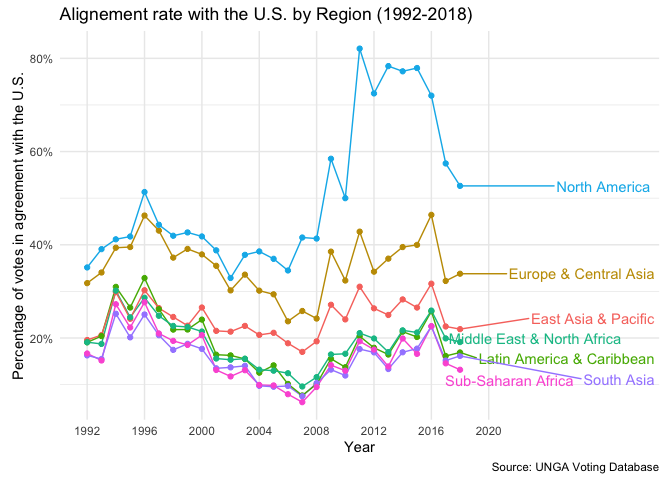<!-- -->

``` r
disagreement_region(china_alignment) +
  labs(
    title = "Alignment rate with China by Region (1992-2018)",
    x = "Year",
    y = "Percentage of votes in agreement with China",
    color = "Subregion",
    caption = "Source: UNGA Voting Database"
  )
```

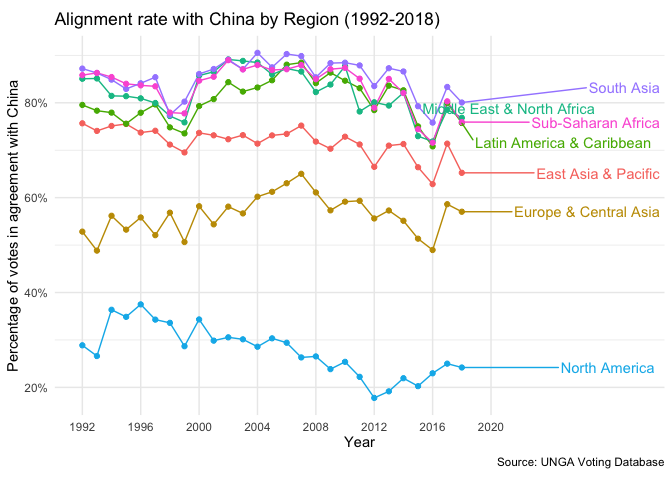<!-- -->

  - The graphs above clearly highlights how regions outside North
    America are in disagreement with the United States. In particular,
    South Asia, Sub-saharan Africa, Middle East, and Latin America all
    have lower than 30% agreement rate with the United States. The
    alignment rates reached the lowest points during the 2004-2006
    period which overlaps with the periods of the Iraq War. We can thus
    deduce that the early 2000s intervention in the Middle East lead to
    rising sentiments of anti-American hegemony across the non-Western
    nations. Even, North American and European nations had low alignment
    rates with the United States during the 2004-2008 period (Bush
    administration period).

  - On the other hand, all regions except North America and Europe &
    Central Asia had over 60 percent disagreement rate with China in the
    United Nations. In particular, the Middle East, Latin America, South
    Asia and Sub-Saharan Africa all had nearly 90% agreement rate. In
    the mean time, North America had less than a 30% disagreement rate
    which is reflective of Canada and the United States’ stance against
    China. Surprinsingly, Europe also had an over 50 percent alignment
    rate with China, despite the substantial U.S. ally nations in
    Western Europe.

**2.4 Important Votes**

  - The United Nations dataset has a variable called “importantvote.”
    This variable captures the votes identified as important by the U.S.
    State Department report on Voting Practices in the United Nations.
    The important votes for 2018 have not been yet reflected in the
    dataset and hence been recorded as “NAs”.

<!-- end list -->

``` r
important_vote <-
  post_cold_war %>%
  distinct(rcid, importantvote) %>%
  drop_na(importantvote) %>%
  count(importantvote == TRUE) %>%
  transmute(prop = n / sum(n))
```

  - Around 17 percent of the votes were classified to be “important” by
    the U.S. State Department between 1992 and 2018.

<!-- end list -->

``` r
df <-
  post_cold_war %>%
  filter(importantvote == TRUE) 

df %>% 
  distinct(
    rcid,
    palestine,
    nuclear_weapons,
    disarmament,
    human_rights,
    colonialism,
    economic_dev
  ) %>%
  count(
    palestine,
    nuclear_weapons,
    disarmament,
    human_rights,
    colonialism,
    economic_dev,
    sort = TRUE
  ) %>%
  pivot_longer(
    cols = palestine:economic_dev,
    names_to = "variables",
    values_to = "truth"
  ) %>%
  filter(truth == TRUE) %>%
  group_by(variables) %>%
  summarize(
    sum = sum(n)
  ) %>% 
  ggplot(aes(reorder(variables, sum), sum)) +
  geom_col() +
  theme_minimal() +
  labs(
    title = "Distribution of Important Votes for the United States (1992-2018)",
    x = NULL,
    y = "Count of Important Votes",
    caption = "Source: UNGA Voting Database"
  )
```

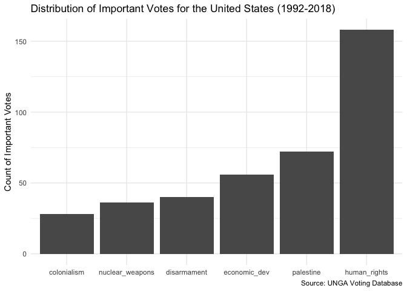<!-- -->

  - The important votes mostly consisted of human rights and Palestine
    related issues. In particular, human rights more than doubled the
    number of votes for palestine (second highest), which demonstrated
    the United States’ prioritization of human rights issue. This also
    primarily explains the nation’s divide from authoritarian regimes
    such as North Korea in the UN voting trend. We will explore this
    pattern, in greater depth, in the coming sections. The high rank of
    Palestine in the list of important votes may potentially relate to
    the high voting alignment rate of Israel to the United States. We
    will also explore this trend below.

<!-- end list -->

``` r
difference_bar(us_alignment %>% filter(importantvote == TRUE)) +
  labs(
    title = 
      "Number of agreements between U.S. and U.N. member states \n almost matches that of disagreement in important votes",
    x = NULL,
    y =
      "Count of UNGA votes between 1992-2018\n classified as important by the U.S.",
    caption = "Source: UNGA Voting Database"
  )
```

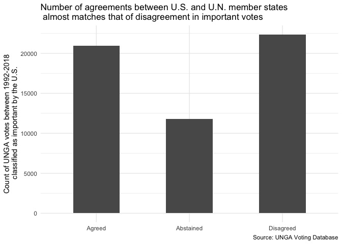<!-- -->

  - Surprisingly, for votes classified as “important”, nations in
    agreement with the U.S. almost equalled that of disagreement. This
    may underscore how the U.S’s hegemnoic leadership in international
    regimes may be enforced through the U.S. securing supportive votes
    in resolutions that it considers to be vital or important.

<!-- end list -->

``` r
difference_bar_issue(us_alignment %>% filter(importantvote == TRUE)) +
  labs(
    title = 
      "Issues important to U.S. affect nation voting behavior",
    subtitle = "Change best demonstrated in Human Rights Issues",
    x = NULL,
    y = "Count of UNGA votes between 1992-2018\n classified as important by the U.S.",
    fill = NULL,
    caption = "Source: UNGA Voting Database"
  )
```

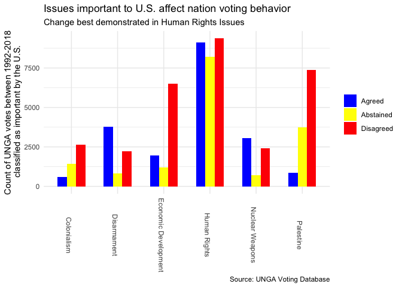<!-- -->

``` r
difference_bar_issue(china_alignment %>% filter(importantvote == TRUE)) +
  labs(
    title = 
      "Nations pivot to Abstaining or Disagreeing with China\n on Human Rights Issues important to U.S",
    x = NULL,
    y = "Count of UNGA votes between 1992-2018\n classified as important by the U.S.",
    fill = NULL,
    caption = "Source: UNGA Voting Database"
  )
```

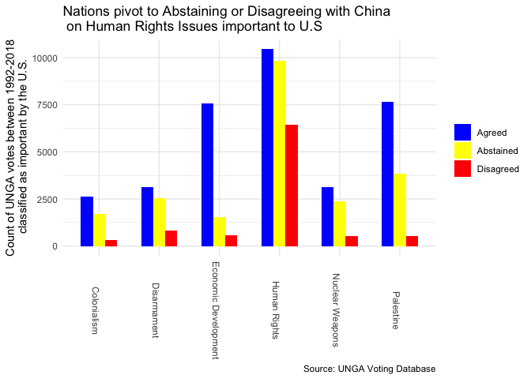<!-- -->

  - Furthering the analysis, the proportion of nations agreeing with
    human rights issues greatly increased for votes designated as
    “important.” In fact, the number of alignment votes on important
    human rights issues (to the U.S.) almost equalled that of
    disagreement votes. Another surprising trend is nations pivotting to
    “abstainment.” The number of abstaining votes was nearly equal to
    that of alignment and disagreement, which signals the potential
    dilemma that states face in between the United States and China.
    While such pressure may be less for issues that U.S. considers as
    less important, nations may opt out chossing sides between U.S. and
    China by abstaining when the “stakes” get higher (i.e. U.S. State
    Department designates “important” status).

  - Another small yet interesting observation is that the important
    issues of disarmament reached a higher proportion of alignment than
    disagreement for the United States. This is the only sub-field out
    of all important votes that has U.S. alignment proportion as the
    highest number of votes.

**2.5 Visualization**

``` r
ROBINSON <- 
  "+proj=robin +lon_0=0 +x_0=0 +y_0=0 +datum=WGS84 +units=m +no_defs"

agreement_map <- function(df, important, name)
  df %>%
  count(countryname, iso, difference) %>%
  pivot_wider(
    names_from = difference,
    values_from = n
  ) %>%
  rename_all(str_to_lower) %>%
  group_by(countryname, iso) %>%
  summarize(prop_agree = agreed / sum(agreed, abstained, disagreed)) %>%
  ungroup() %>%
  full_join(country_info %>% select(iso, geometry), by = "iso") %>%
  st_as_sf(
    crs = 4326, remove = FALSE
  ) %>%
  st_transform(crs = ROBINSON) %>%
  ggplot() +
  geom_sf(aes(fill = prop_agree), size = 0.01) +
  guides(
    fill = guide_colorbar(
      barheight = 0.5,
      barwidth = 15,
      title = NULL
    )
  ) +
  theme_void() +
  theme(
    legend.direction = "horizontal",
    legend.position = "bottom",
    plot.title = element_text(hjust = 0.5),
    plot.subtitle = element_text(hjust = 0.5)
  ) +
  labs(
    subtitle = 
      str_c("Percentage of ", important,"votes in agreement with ", name, " (1992-2018)"),
    caption = "Source: UNGA Voting Database"
  )
```

``` r
# Map for the United States
agreement_map(us_alignment, "", "the U.S.") +
  scale_fill_gradientn(
    breaks = seq(0.1, 0.7, 0.1),
    labels = 
      c("10-%", "20%", "30%", "40%", "50%",
        "60%", "70+%"),
    colors = MAP_COLORS,
    na.value = MAP_NA_COLOR
  ) 
```

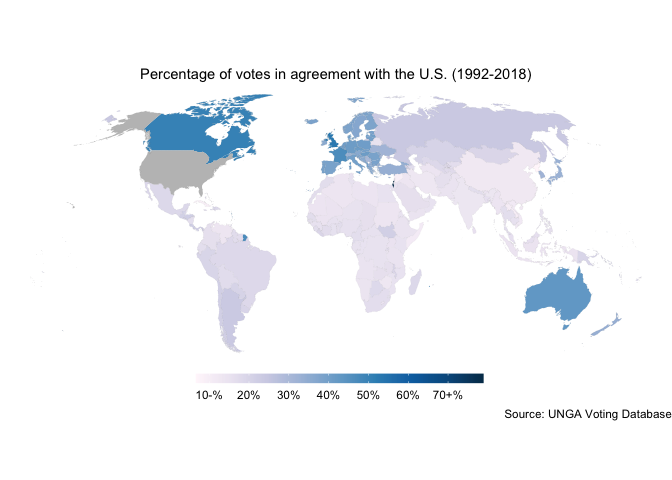<!-- -->

  - The map above indicates how only Israel, Canada, Australia, France
    and the UK were in relatively strong agreement with the United
    States in the United Nations General Assembly. Traditional United
    States’ allies including Korea, Japan, New Zealand, and European
    nations were positioned in the “middle ground” in terms of their
    voting alignment with the United States. The rest of the world had
    low voting alignment percentage with the United States.

<!-- end list -->

``` r
# Map for China
agreement_map(china_alignment, "", "China") +
  scale_fill_gradientn(
    breaks = seq(0.2, 0.9, 0.1),
    labels = 
      c("20%-", "30%", "40%", "50%",
        "60%", "70%", "80%", "90%+"),
    colors = MAP_COLORS,
    na.value = MAP_NA_COLOR
  )
```

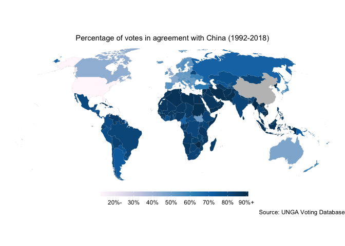<!-- -->

  - The map above indicates how only United States and Israel were in
    strong disagreement with China in their United Nations General
    Assembly voting pattern. Countries in Africa, Middle East, South
    East Asia, Latin Americ and Central Asia (alongside North Korea)
    strongly agreed with China. Some even displayed over a 90% alignment
    in votes. Traditional United States’ allies including Korea, Japan,
    New Zealand, and Western European nations also had relatively
    “strong” alignment percentages with China.

**2.6 Visualization for Important Votes**

  - The story may be slightly different, however, when we visualize the
    “percentage of votes in agreement with the U.S.” for votes
    classified as important by the State Department. We assess whether
    the important votes make a difference in nation’s voting pattern.

<!-- end list -->

``` r
agreement_map(
  us_alignment %>% filter(importantvote == TRUE), "important ", "the U.S."
) +
  scale_fill_gradientn(
    breaks = seq(0.1, 0.8, 0.1),
    labels = 
      c("10%-", "20%", "30%", "40%", "50%",
        "60%", "70%", "80%+"),
    colors = MAP_COLORS,
    na.value = MAP_NA_COLOR
  )
```

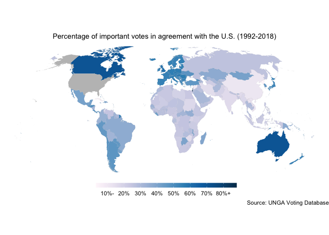<!-- -->

``` r
agreement_map(
  china_alignment %>% filter(importantvote == TRUE), "important ", "China"
) +
  scale_fill_gradientn(
    breaks = seq(0.2, 0.8, 0.1),
    labels = 
      c("20%-", "30%", "40%", "50%",
        "60%", "70%", "80%+"),
    colors = MAP_COLORS,
    na.value = MAP_NA_COLOR
  )
```

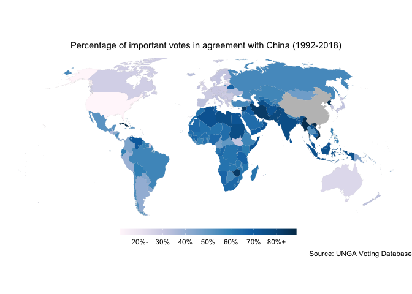<!-- -->

  - The maps above indicates how, for votes classified as “important” by
    the U.S. State Department, nations mostly increased in their voting
    alignment with the United States. Canada, Australia and Israel
    turned “dark blue” indicating their strong agreement in voting.
    United States’ allies such as Korea, Japan, and European nations
    also increased in their alignment percentage with the United States.
    Countries in South America, Africa and Central Asia also increased
    in their alignment with the United States. In the mean time, China
    remained to be in strong disagreement with the United States.

  - Such an increase in voting alignment further underlines how, while
    the nations may disagree with the United States, realist and
    constructivist alliance considerations compel them to vote in
    alignment with the hegemon on key resolutions.

**2.7 Proportion difference between important and general
(non-important) votes**

``` r
general <-
  us_alignment %>%
  count(countryname, iso, difference) %>%
  pivot_wider(
    names_from = difference,
    values_from = n
  ) %>%
  rename_all(str_to_lower) %>%
  group_by(countryname, iso) %>%
  summarize(prop_agree = agreed / sum(agreed, abstained, disagreed)) %>%
  ungroup()

important <-
  us_alignment %>%
  filter(importantvote == TRUE) %>%
  count(countryname, iso, difference) %>%
  pivot_wider(
    names_from = difference,
    values_from = n
  ) %>%
  rename_all(str_to_lower) %>%
  group_by(countryname, iso) %>%
  summarize(
    prop_agree_important = agreed / sum(agreed, abstained, disagreed)
  ) %>%
  ungroup()

general %>%
  left_join(
    important %>%  select(iso, prop_agree_important),
    by = "iso"
  ) %>%
  transmute(
    countryname,
    prop_increase = (prop_agree_important - prop_agree) / prop_agree
  ) %>%
  arrange(desc(prop_increase)) %>%
  top_n(10)
```

    ## Selecting by prop_increase

    ## # A tibble: 10 x 2
    ##    countryname           prop_increase
    ##    <chr>                         <dbl>
    ##  1 Timor-Leste                    2.21
    ##  2 El Salvador                    1.53
    ##  3 Peru                           1.31
    ##  4 Sao Tome and Principe          1.28
    ##  5 Belize                         1.27
    ##  6 Liberia                        1.27
    ##  7 Bahamas                        1.24
    ##  8 Paraguay                       1.23
    ##  9 Honduras                       1.22
    ## 10 Mexico                         1.22

``` r
general %>%
  left_join(
    important %>%  select(iso, prop_agree_important),
    by = "iso"
  ) %>%
  transmute(
    countryname,
    prop_increase = (prop_agree_important - prop_agree) / prop_agree
  ) %>%
  arrange(desc(prop_increase)) %>%
  top_n(-10)
```

    ## Selecting by prop_increase

    ## # A tibble: 10 x 2
    ##    countryname                                          prop_increase
    ##    <chr>                                                        <dbl>
    ##  1 France                                                      0.170 
    ##  2 United Kingdom of Great Britain and Northern Ireland        0.143 
    ##  3 Lao People's Democratic Republic                            0.118 
    ##  4 Israel                                                      0.116 
    ##  5 Russian Federation                                          0.0862
    ##  6 Viet Nam                                                    0.0771
    ##  7 China                                                      -0.0869
    ##  8 Syrian Arab Republic                                       -0.106 
    ##  9 Cuba                                                       -0.317 
    ## 10 Democratic People's Republic of Korea                      -0.534

  - We notice how except for four nations (China, Syria, Cuba and North
    Korea), all nations increased in their agreement percentage with the
    United States as the votes became classified as “important” by the
    State Department. These four nations are traditionally classified as
    having antithetical state objectives from the United States with
    their government system being authoritarian dictatorship.

  - On the other hand, Latin American, South American nations
    demonstrated the greatest increase in alignment percentage alongside
    Timor-Leste and Liberia.

**Part 3: China vs. United States**

  - Consider the resolutions where the U.S. and China had opposing
    votes. We explore which voting option each nation “leaned most
    favorably towards” over 1992-2018. We also examine whether there was
    any difference for votes classified as “important.”

<!-- end list -->

``` r
us_china_diff <-
  us_alignment %>%
  filter(iso == "chn", difference == "Disagreed") %>%
  #  filter_at(vars(me, nu, di, co, hr, ec), all_vars(. == FALSE)) %>%
  pull(rcid)

us_china_map <- function(df)
  df %>%    
  filter(
    rcid %in% us_china_diff, 
    iso != "chn"
  ) %>%
  count(iso, difference) %>%
  pivot_wider(
    names_from = difference,
    values_from = n
  ) %>%
  rename_all(str_to_lower) %>%
  group_by(iso) %>%
  mutate(
    America = replace_na(agreed, 0),
    China = replace_na(disagreed, 0),
    Abstained = replace_na(abstained, 0),
    sum = sum(America, Abstained, China)
  ) %>%
  summarize_at(vars(America, Abstained, China), ~ . / sum) %>%
  group_by(iso) %>%
  mutate(
    top_prop = 
      c("America", "Abstained", "China")
    [which.max(c(America, Abstained, China))]
  ) %>%
  ungroup()

country_info %>%
  left_join(us_china_map(us_alignment), by = "iso") %>%
  st_as_sf(
    crs = 4326, remove = FALSE
  ) %>%
  st_transform(crs = ROBINSON) %>%
  ggplot() +
  geom_sf(aes(fill = top_prop), size = 0.01) +
  scale_fill_manual(
    limits = c("America", "Abstained", "China"),
    values = c("blue", "yellow", "red"),
    na.value = "grey"
  ) +
  theme_void() +
  labs(
    title =
      "Most voted option when U.S. and China had opposing votes (1992-2018)",
    fill = NULL,
    caption = "Source: UNGA Voting Database"
  )
```

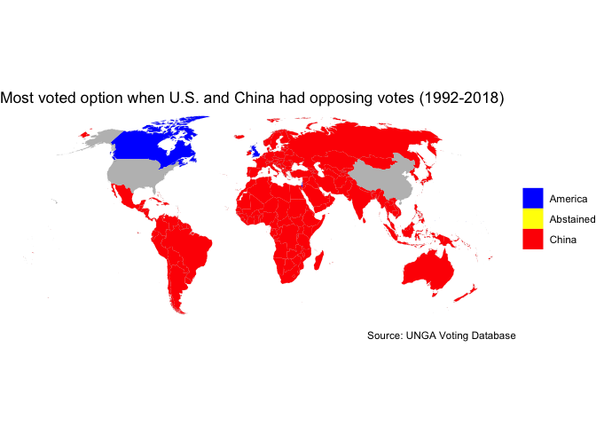<!-- -->

  - In the general votes, we can confirm the trends examined above in
    our one-dimensional EDA. Even traditional allies in Western Europe
    and East Asia side with China, while only Israel, United Kingdom and
    Canada have voted in alignment with United States. The entirety of
    Africa, Asia, Oceania, Latin America, and South America vote more in
    alignment with China than the U.S. Such a pattern clearly
    demonstrates how the U.S. differs with the rest of the world on many
    issues, despite being the alleged hegemonic leader. Moreover, the
    U.S. appears to have many fundamental disagreements with even its
    own allies. Then we must ask: what is the hegemonic basis of the
    U.S. leadership?

<!-- end list -->

``` r
country_info %>%
  left_join(
    us_china_map(us_alignment %>% filter(importantvote == TRUE)), by = "iso"
  ) %>%
  st_as_sf(
    crs = 4326, remove = FALSE
  ) %>%
  st_transform(crs = ROBINSON) %>%
  ggplot() +
  geom_sf(aes(fill = top_prop), size = 0.01) +
  scale_fill_manual(
    limits = c("America", "Abstained", "China"),
    values = c("blue", "yellow", "red"),
    na.value = "grey"
  ) +
  theme_void() +
  labs(
    title =
      "Most voted option when U.S. and China had opposing votes (1992-2018)",
    subtitle = "Votes that the U.S. State Department classified as important",
    fill = NULL,
    caption = "Source: UNGA Voting Database"
  )
```

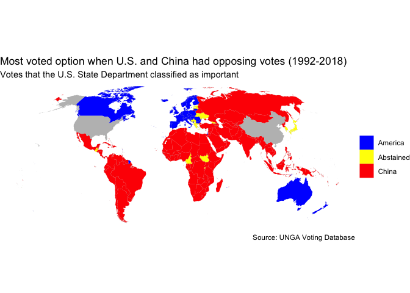<!-- -->

  - Based on the observation that important votes affects state
    behavior, we map what voting option each nation would seek when the
    “stakes” of the votes get higher. In particular, if the United
    States and China differ in their voting options, and the vote is
    classifed as important by the State Department, then that vote is
    “extra” sensitive in the perspective of other nations (especially
    those who have investments or military assistance from both China
    and the U.S.).

  - We observe how democracies in high income nations (traditional U.S.
    allies) such as Canada, Australia, New Zealand, Israel, and the
    entirety of Western Europe side with America in these sensitive
    votes. This is sharp difference from the general votes where only
    the U.K. voted in favor of the U.S.

  - The important vote factor, however, only affected electoral
    democracies. Examining the nations that voted in agreement with the
    U.S., none of the non-electoral democracies voted more in alignment
    with the U.S. than China. This demonstrates how identity matters,
    even in the power-structured world. The realist framework of “power”
    only becomes relevant when two nations have similar “identities.”

  - Africa, Middle East, South Asia, Latin America and South America,
    however, mostly remained in favor of China. This can be attributed
    to two factors: anti-American sentiments and the growth in Chinese
    influence through the Belt and Road Initiative (BRI) and the Asian
    Infrastructure Investment Bank (AIIB).

  - Another surprising trend is the abstaining states. We take a closer
    look at those states below:

<!-- end list -->

``` r
country_info %>%
  left_join(
    us_china_map(us_alignment %>% filter(importantvote == TRUE)), by = "iso"
  ) %>%
  st_as_sf(
    crs = 4326, remove = FALSE
  ) %>%
  st_transform(crs = ROBINSON) %>%
  ggplot() +
  geom_sf(aes(fill = top_prop), size = 0.01) +
  ggrepel::geom_label_repel(
    aes(
      label = country, geometry = geometry, color = electoral_democracy
    ),
    data = 
      . %>% filter(top_prop == "Abstained"),
    stat = "sf_coordinates",
    nudge_x = 10
  ) +
  scale_fill_manual(
    limits = c("America", "Abstained", "China"),
    values = c("grey", "yellow", "grey"),
    na.value = "grey",
    guide = NULL
  ) +
  scale_color_manual(
    limits = c("Yes", "No"),
    values = c("blue", "red")
  ) +
  theme_void() +
  labs(
    title =
      "Countries who abstained the most when U.S. and China had opposing votes",
    subtitle = "Votes that the U.S. State Department classified as important",
    fill = NULL,
    color = "Electoral Democracy?",
    caption = "Source: UNGA Voting Database"
  )
```

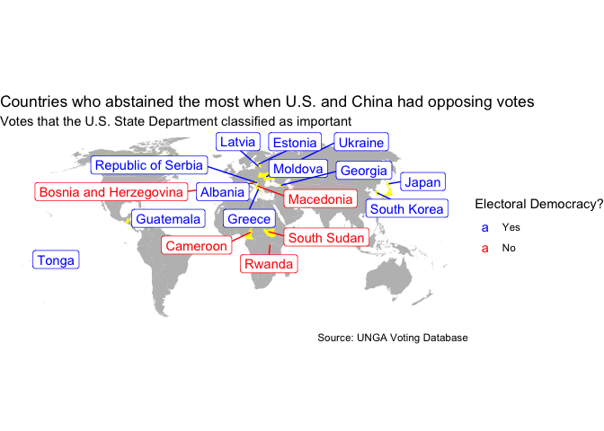<!-- -->

  - We observe how democracies in Eastern Europe such as Greece,
    Albania, Moldova, Latvia, Estonia and Ukraine as well as traditional
    U.S. allies such as Japan and South Korea all vote “abstain” when
    U.S. and China conflict. Other outliers include Tonga, Guatemala and
    three non-electoral democracy nations in Africa (Cameroon, South
    Sudan, Rwanda). Such an observation indicates how relatively weaker
    nations often lie in a stranded position between the two
    superpowers.

  - For instance, the Eastern European nations that voted “abstain”
    receive investment from China through the Cooperation between China
    and Central and Eastern European Countries (also known as “17+1”).
    Moreover, a substantial portion of the Korean and Japanese economy
    (as well as tourism) depend on China due to dependent export and
    import relations. Such a strong influence from China may force
    nations to opt out from choosing between the two superpowers on
    sensitive topics, even when they have more principles in common with
    the U.S. stance.

**Democracy and Income Map of the World**

``` r
country_info %>%
  st_as_sf(
    crs = 4326, remove = FALSE
  ) %>%
  st_transform(crs = ROBINSON) %>%
  ggplot() +
  geom_sf(aes(fill = electoral_democracy), size = 0.01) +
  theme_void() +
  labs(
    fill = "Electoral Democracy?",
    subtitle = "Map of Electoral Democracies as of 2019",
    caption = "Source: Freedom House"
  )
```

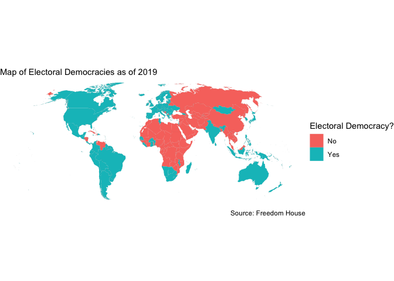<!-- -->

``` r
country_info %>%
  st_as_sf(
    crs = 4326, remove = FALSE
  ) %>%
  st_transform(crs = ROBINSON) %>%
  ggplot() +
  geom_sf(aes(fill = income_grp), size = 0.01) +
  theme_void() +
  labs(
    fill = "Income Level",
    subtitle = "Map of Nation's Income Levels",
    caption = "Source: Gapminder Data"
  )
```

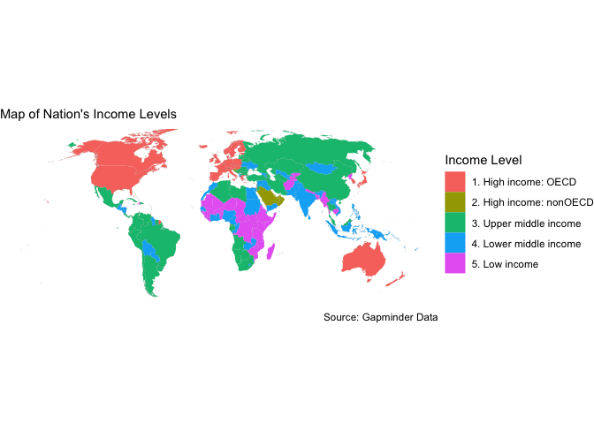<!-- -->

  - Democratic and high-income nations (Canada, Europe, Australia, New
    Zealand, Israel, Korea, Japan) were likely to vote in alignment with
    the United States. Non-democracies were likely to vote in alignment
    with China. So were middle income nations such as Brazil, India
    South Africa, Indonesia, Mexico, and Egypt.
