Progress report 2
================
JB Lim
2020-02-18

## Section

``` r
library(tidyverse)
library(sf)
library(lubridate)

# Parameters
un_voting_file <-
  here::here("c01-own/data/un_voting_wrangled.rds")

country_border_data_democracy_file <-
  here::here("c01-own/data/country_border_data_democracy.rds")
#===============================================================================
# Reading in the data files.
un_voting <-  
  un_voting_file %>%
  read_rds() %>%
  mutate_at(vars(country), ~ str_to_lower(.))

country_info <-
  country_border_data_democracy_file %>%
  read_rds()

vote_code <-
  c(1, 2, 3)

MAP_COLORS <- RColorBrewer::brewer.pal(n = 9, name = "PuRd")

MAP_COLORS_2 <- RColorBrewer::brewer.pal(n = 9, name = "PuBu")
MAP_NA_COLOR <- "grey75"
```

**The Basis of the United States’ Hegemonic Leadership in the Post
Cold-War Era**

  - We will be dropping “Czechoslovakia” and “Yugoslavia” which ceased
    to exist in 1992 and 1993 respectively (only represents 77 out of
    862969 observations).

<!-- end list -->

``` r
post_cold_war <-  
  un_voting %>%
  filter(year > 1991) %>%
  left_join(
    country_info %>%
      select(-country),
    c("country" = "iso")
  ) %>%
  select(
    rcid,
    vote,
    iso = country,
    countryname, 
    year,
    importantvote,
    descr:un_member_date
  ) %>%
  drop_na(electoral_democracy)
```

``` r
target_nation_vote <- function(x)
  post_cold_war %>%
  group_by(rcid) %>%
  filter(iso == x) %>%
  select(rcid, vote) %>%
  rename_at(vars(vote), ~ str_c(., "_", x)) %>%
  ungroup()

voting_alignment <- function(df, vars, target_code)
  post_cold_war %>%
  left_join(df, by = "rcid") %>%
  filter(iso != target_code) %>%
  filter(
    vote %in% vote_code,
    {{vars}} %in% vote_code
  ) %>%
  mutate(
    difference = abs(vote - {{vars}}),
    difference = 
      factor(
        difference,
        labels = 
          c("Agreed", "Abstained", "Disagreed")
      )
  )

usa <-
  voting_alignment(target_nation_vote("usa"), vote_usa, "usa")

china <-
  voting_alignment(target_nation_vote("chn"), vote_chn, "chn")
```

**How much nations differed with the United States (1992-2018)**

``` r
difference_bar <- function(df)
  df %>%
  ggplot(aes(difference)) +
  geom_bar(width = 0.5) +
  scale_y_continuous(
    breaks = scales::breaks_width(25000)
  ) +
  theme_minimal()

difference_bar(usa) +
  labs(
    title = 
      "Number of disagreements with U.S. and U.N. member states \nmore than doubles that of agreement",
    x = NULL,
    y = "Count of UNGA votes between 1992-2018"
  )
```

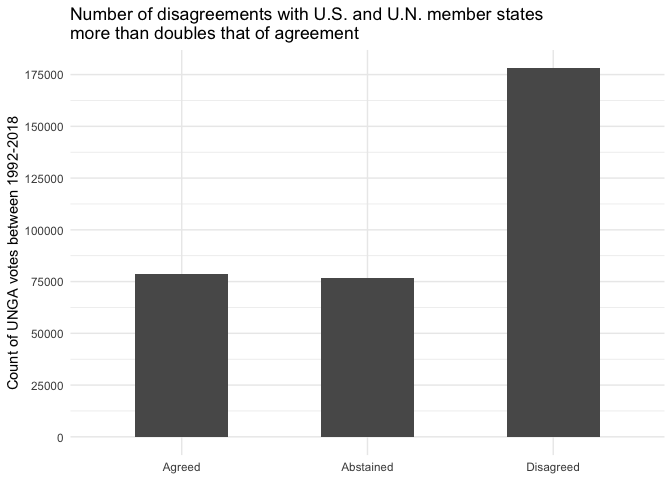<!-- -->

``` r
difference_bar(china) +
  labs(
    title = 
      "Number of agreements between China and U.N. member states \n was about ten times that of disagreement",
    x = NULL,
    y = "Count of UNGA votes between 1992-2018"
  )
```

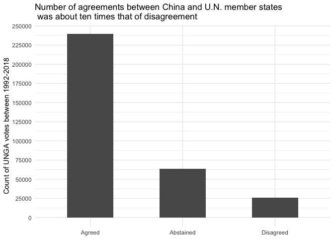<!-- -->

``` r
disagreement_region <- function(df)
  df %>%
  count(year, subregion, difference) %>%
  pivot_wider(
    names_from = difference,
    values_from = n
  ) %>%
  rename_all(str_to_lower) %>%
  group_by(year, subregion) %>%
  summarize(
    prop_disagree = 
      disagreed / sum(agreed, abstained, disagreed)
  ) %>%
  ungroup() %>%
  ggplot(
    aes(year, prop_disagree, color = fct_reorder(subregion, prop_disagree))
  ) +
  geom_line() +
  geom_point() +
  scale_x_continuous(
    breaks = seq(1992, 2020, 4),
    minor_breaks = NULL,
    limits = c(1992, 2030)
  ) +
  ggrepel::geom_text_repel(
    aes(label = subregion),
    data = 
      . %>% group_by(year, subregion) %>% filter(year == 2018),
    nudge_x = 10
  ) +
  scale_y_continuous(labels = scales::percent_format(accuracy = 1)) +
  coord_fixed(ratio = 32.5) +
  guides(color = "none") +
  theme_minimal()

disagreement_region(usa) +
  labs(
    title = "Disagreement rate with the U.S. by Region (1992-2018)",
    x = "Year",
    y = "Percentage of votes in disagreement with the U.S.",
    color = "Subregion",
    caption = "Source: UNGA Voting Database"
  )
```

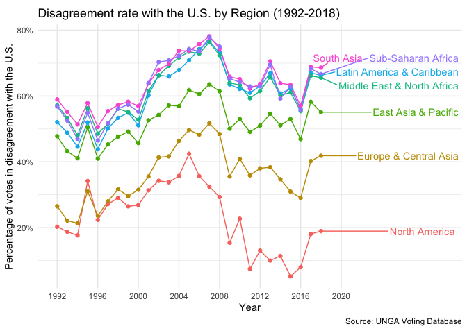<!-- -->

``` r
disagreement_region(china) +
  labs(
    title = "Disagreement rate with China by Region (1992-2018)",
    x = "Year",
    y = "Percentage of votes in disagreement with China",
    color = "Subregion",
    caption = "Source: UNGA Voting Database"
  )
```

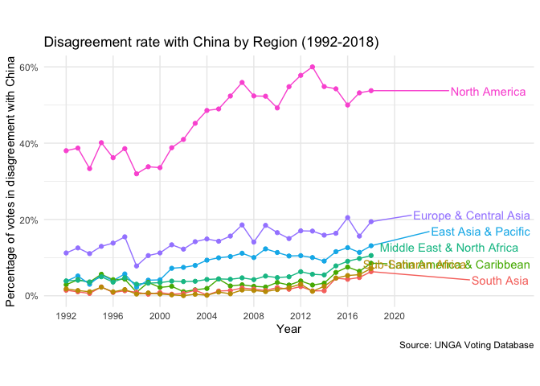<!-- -->

``` r
disagreement_map <- function(df, name)
  df %>%
  count(countryname, iso, difference) %>%
  pivot_wider(
    names_from = difference,
    values_from = n
  ) %>%
  rename_all(str_to_lower) %>%
  group_by(countryname, iso) %>%
  summarize(
    prop_disagree = 
      disagreed / sum(agreed, abstained, disagreed)
  ) %>%
  ungroup() %>%
  full_join(country_info %>% select(iso, geometry), by = "iso") %>%
  st_as_sf(.) %>%
  ggplot() +
  geom_sf(aes(fill = prop_disagree), size = 0.01) +
  scale_fill_gradientn(
    breaks = seq(0.1, 0.7, 0.1),
    labels = 
      c("10-%", "20%", "30%", "40%", "50%",
        "60%", "70+%"),
    colors = MAP_COLORS,
    na.value = MAP_NA_COLOR
  ) +
  guides(
    fill = guide_colorbar(
      barheight = 0.5,
      barwidth = 15,
      title = NULL
    )
  ) +
  theme_void() +
  theme(
    legend.direction = "horizontal",
    legend.position = "bottom",
    plot.title = element_text(hjust = 0.5),
    plot.subtitle = element_text(hjust = 0.5)
  ) +
  labs(
    subtitle = 
      str_c("Percentage of votes in disagreement with ", name, " (1992-2018)"),
    caption = "Source: UNGA Voting Database"
  )

disagreement_map(usa, "the USA")
```

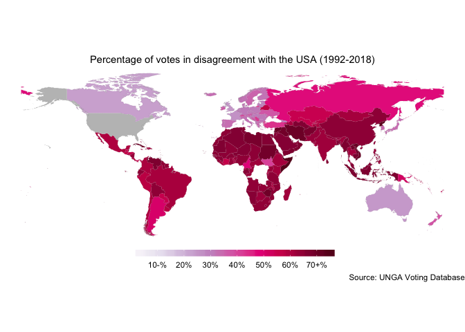<!-- -->

``` r
disagreement_map(china, "China")
```

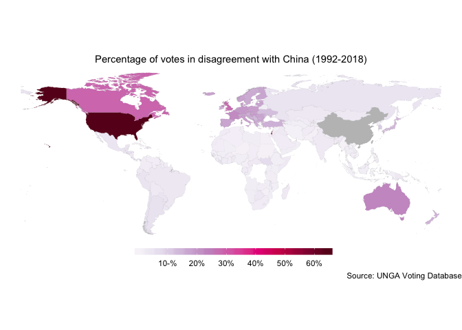<!-- -->

``` r
agreement_map <- function(df, name)
  df %>%
  count(countryname, iso, difference) %>%
  pivot_wider(
    names_from = difference,
    values_from = n
  ) %>%
  rename_all(str_to_lower) %>%
  group_by(countryname, iso) %>%
  summarize(
    prop_agree = 
      agreed / sum(agreed, abstained, disagreed)
  ) %>%
  ungroup() %>%
  full_join(country_info %>% select(iso, geometry), by = "iso") %>%
  st_as_sf(.) %>%
  ggplot() +
  geom_sf(aes(fill = prop_agree), size = 0.01) +
  scale_fill_gradientn(
    breaks = seq(0.1, 0.7, 0.1),
    labels = 
      c("10-%", "20%", "30%", "40%", "50%",
        "60%", "70+%"),
    colors = MAP_COLORS_2,
    na.value = MAP_NA_COLOR
  ) +
  guides(
    fill = guide_colorbar(
      barheight = 0.5,
      barwidth = 15,
      title = NULL
    )
  ) +
  theme_void() +
  theme(
    legend.direction = "horizontal",
    legend.position = "bottom",
    plot.title = element_text(hjust = 0.5),
    plot.subtitle = element_text(hjust = 0.5)
  ) +
  labs(
    subtitle = 
      str_c("Percentage of votes in agreement with ", name, " (1992-2018)"),
    caption = "Source: UNGA Voting Database"
  )

agreement_map(usa, "the USA")
```

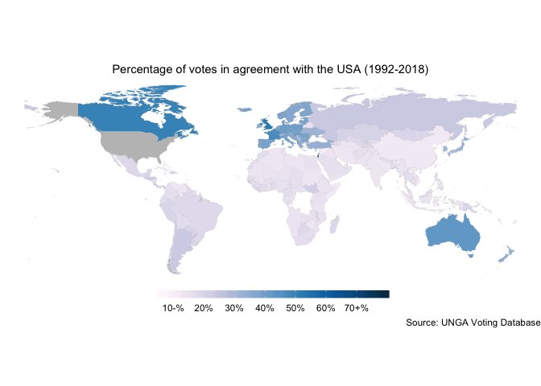<!-- -->

``` r
agreement_map(china, "China")
```

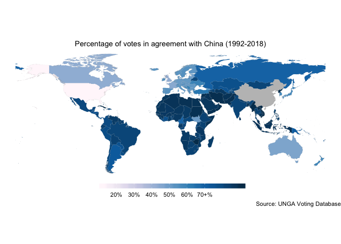<!-- -->

``` r
country_info %>%
  st_as_sf(.) %>%
  ggplot() +
  geom_sf(aes(fill = electoral_democracy), size = 0.01) +
  theme_void() +
  labs(
    fill = "Electoral Democracy?",
    subtitle = "Map of Electoral Democracies as of 2019",
    caption = "Source: Freedom House"
  )
```

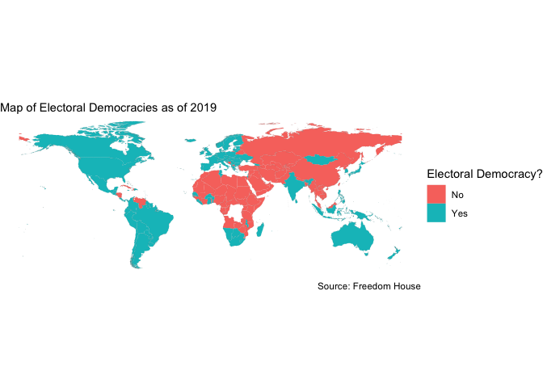<!-- -->

``` r
country_info %>%
  st_as_sf(.) %>%
  ggplot() +
  geom_sf(aes(fill = income_level), size = 0.01) +
  theme_void() +
  labs(
    fill = "Income Level",
    subtitle = "Map of Nation's Income Levels",
    caption = "Source: Gapminder Data"
  )
```

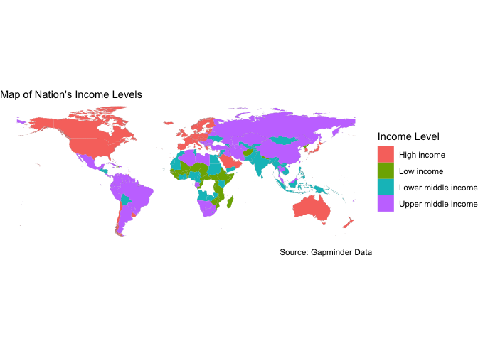<!-- -->

``` r
us_china_diff <-
  usa %>%
  filter(iso == "chn", difference == "Disagreed") %>%
  pull(rcid)

us_china <-
  usa %>%
  filter(
    rcid %in% us_china_diff, 
    iso != "chn"
  ) %>%
  count(iso, difference) %>%
  pivot_wider(
    names_from = difference,
    values_from = n
  ) %>%
  rename_all(str_to_lower) %>%
  group_by(iso) %>%
  mutate(
    agreed = replace_na(agreed, 0),
    sum = sum(agreed, abstained, disagreed)
  ) %>%
  summarize_at(vars(agreed, abstained, disagreed), ~ . / sum) %>%
  mutate(
    top_prop = apply(.[,2:4], 1, function(x) names(x)[which.max(x)])
  )

country_info %>%
  left_join(us_china, by = "iso") %>%
  st_as_sf() %>%
  ggplot() +
  geom_sf(aes(fill = top_prop), size = 0.01)
```

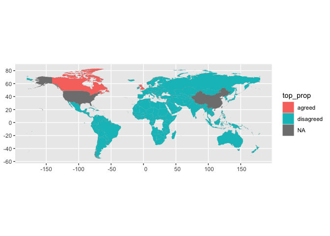<!-- -->
