UN Voting Patterns
================
JB Lim
2020-02-28

``` r
# Libraries
library(tidyverse)
library(sf)

# If you will not be providing answers, simply delete the following lines.
# Parameters
  # File where generated answers are saved, by default in the home directory
file_answers <- "~/answers.rds"
  # Save answers
SAVE_ANSWERS <- TRUE


un_voting_file <-
  here::here("c01-own/data/un_voting_wrangled.rds")

country_information_file <-
  here::here("c01-own/data/country_border_data_democracy.rds")

# Voting Codes
vote_code <-
  c(1, 2, 3)

# Map Aesthetics
MAP_COLORS <- RColorBrewer::brewer.pal(n = 9, name = "PuBu")
MAP_NA_COLOR <- "grey75"
```

## Challenge

**Background Context**

  - This challenge deals with the **“United Nations General Assembly
    Voting Data”** posted on the *Harvard Dataverse.* The dataset
    examines all the “roll-call votes in the UN General Assembly” from
    1946 to 2018.

  - The code book
    <https://dataverse.harvard.edu/file.xhtml?persistentId=doi:10.7910/DVN/LEJUQZ/IPRJ61&version=21.0>
    of the dataset articulates the variables of the raw UNGA dataset.
    Notable variables include Vote Choice (with 1 as Yes, 2 as Abstain,
    3 as No, 8 as Absent, 9 as Not a member), Country Code, Year of
    Vote, Votes identified as important by U.S. State Department report
    and Issue Codes.
    
      - Issue Codes include: Votes relating to the Palestinian Conflict,
        Nuclear weapons and nuclear material, Arms control and
        disarmanent, Colonialism, Human Rights, Economic Development.

  - The UN voting dataset has already been partially wrangled to account
    for transitions and dissolutions in certain states such as
    Yugoslavia or Czechoslovakia. This challenge focuses more on the
    exploratory data analysis and visualization aspect.

  - The country information file contains the boundary and relevant
    information (from Natural Earth) for 192 UN member states. The
    information dataset also includes While the United Nations has 193
    member states, the information dataset provided excludes Tuvalu due
    to its absence from the original “Natural Earth” dataset.

  - Both datasets can be found in the Data Box
    <https://stanford.app.box.com/folder/104837039459>.

  - Finally, the information dataset includes additional facts on the
    status of democracy in 2019 (imported from “Freedom in the World”)
    and UN Membership status from the Gapminder dataset covered in the
    Stanford Data Challenge Lab course.

**Objective**

In this challenge, we will be examining the status of the United States’
hegemonic leadership in the post Cold-War era (1992-2018) by assessing
the voting behaviors of other nations in the United Nations General
Assembly.

**Reading Data + Wrangling**

**q1** After reading in both files, filter for UN General Assembly Votes
from 1992 to 2018. Then, combine the United Nations voting dataset with
the country information dataset. In doing so, note the following:

  - We will be dropping “Czechoslovakia” and “Yugoslavia” which ceased
    to exist in 1992 and 1993 respectively (only represents 77 out of
    862969 observations) from the UN General Assembly Dataset.

  - Rename: “country” to “iso”, “me” to “palestine”, “nu” to
    “nuclear\_weapons”, “di” to “disarmament”, “hr” to
    “human\_rights”, “co” to “colonialism”, “ec” to “economic\_dev”

  - Select the following variables: rcid, vote, iso, countryname, year,
    important vote, me, nu, di, hr, co, ec + all the variables in
    country information.

<!-- end list -->

``` r
# UN voting data
un_voting <-  
  un_voting_file %>%
  read_rds() %>%
  mutate(country = str_to_lower(country))

# Country Information
country_info <-
  country_information_file %>%
  read_rds()


# Combining the two data sets
q1 <-
  un_voting %>%
  filter(year > 1991) %>%
  left_join(
    country_info %>% select(-country),
    by = c("country" = "iso")
  ) %>%
  drop_na(electoral_democracy) %>%
  select(
    rcid,
    vote,
    iso = country,
    countryname, 
    year,
    importantvote,
    palestine = me,
    nuclear_weapons = nu,
    disarmament = di,
    human_rights = hr,
    colonialism = co,
    economic_dev = ec,
    pop_est:electoral_democracy
  )

# Print results
if (exists("q1")) q1
```

    ## # A tibble: 373,870 x 23
    ##     rcid  vote iso   countryname  year importantvote palestine nuclear_weapons
    ##    <int> <int> <chr> <chr>       <int> <lgl>         <lgl>     <lgl>          
    ##  1  3662     1 usa   United Sta…  1992 FALSE         FALSE     FALSE          
    ##  2  3662     1 can   Canada       1992 FALSE         FALSE     FALSE          
    ##  3  3662     1 bhs   Bahamas      1992 FALSE         FALSE     FALSE          
    ##  4  3662     1 cub   Cuba         1992 FALSE         FALSE     FALSE          
    ##  5  3662     8 hti   Haiti        1992 FALSE         FALSE     FALSE          
    ##  6  3662     8 dom   Dominican …  1992 FALSE         FALSE     FALSE          
    ##  7  3662     1 jam   Jamaica      1992 FALSE         FALSE     FALSE          
    ##  8  3662     1 tto   Trinidad a…  1992 FALSE         FALSE     FALSE          
    ##  9  3662     1 brb   Barbados     1992 FALSE         FALSE     FALSE          
    ## 10  3662     8 dma   Dominica     1992 FALSE         FALSE     FALSE          
    ## # … with 373,860 more rows, and 15 more variables: disarmament <lgl>,
    ## #   human_rights <lgl>, colonialism <lgl>, economic_dev <lgl>, pop_est <dbl>,
    ## #   pop_rank <int>, gdp_md_est <dbl>, economy <chr>, income_grp <chr>,
    ## #   continent <chr>, subregion <chr>, region_wb <chr>, geometry <list>,
    ## #   un_member_date <dbl>, electoral_democracy <chr>

**Calculating Alignment**

**q2** Let’s try to calculate the “alignment” of votes between the
United States and other UN member states for all the unique resolutions
since 1992. The rcid code uniquely identifies each distinct resolution
from 1992 to 2018. The variable vote indicates the countries vote for
the specific resolution. For now, let’s focus on the votes “Yes”, “No”
and “Abstain.” Refer to the documentation on the dataset to understand
the numeric codes for each corresponding vote.

To do this, we would need the following pieces of information: 1.
Retrieve information on the United States’ (or any desired nations’)
voting record for every resolution (rcid). 2. Compare that with other
nations through grouping by each rcid. 3. Calculating the difference in
votes using absolute values and providing appropriate labels.

**q2.1** Build a function called “target\_nation” that takes in a string
of iso code and returns a tibble with two variables: each unique rcid
and the target nations’ vote.

``` r
target_nation <- function(x)
  q1 %>%
  group_by(rcid) %>%
  filter(iso == x) %>%
  select(rcid, vote) %>%
  rename_at(vars(vote), ~ str_c(., "_", x)) %>%
  ungroup()
```

**q2.2** Build another function called “Alignment” that takes in a
tibble of target nation votes and returns a tibble with a new variable
“difference.” The “difference” variable should be factorized from
numeric values into categorical values(“Agreed”, “Abstained”,
“Disagreed”).

Hint: The variable for the “target nation votes” should have a “general
name,” so that that the user does not have to manually change the name
everytime the alignment is calculated. This may require an additional
line of code for the function in quesiton 2.

Hint 2: The target nation being examined should be filtered out before
calculating the alignment.

``` r
alignment <- function(df, vars, target_code)
  q1 %>%
  left_join(df, by = "rcid") %>%
  filter(
    iso != target_code,
    vote %in% vote_code,
    {{vars}} %in% vote_code
  ) %>%
  mutate(
    difference = abs(vote - {{vars}}),
    difference = 
      factor(
        difference,
        labels = 
          c("Agreed", "Abstained", "Disagreed")
      )
  )
```

**q3** Use the two functions above to create a tibble with the voting
alignment trend for the United States from 1992 to 2018. Store the
answers in q3.

Note: Exclude the column listing the target nation’s votes.

``` r
q3 <-
  alignment(target_nation("usa"), vote_usa, "usa") %>%
  select(-vote_usa)

# Print results
if (exists("q3")) q3
```

    ## # A tibble: 332,490 x 24
    ##     rcid  vote iso   countryname  year importantvote palestine nuclear_weapons
    ##    <int> <int> <chr> <chr>       <int> <lgl>         <lgl>     <lgl>          
    ##  1  3662     1 can   Canada       1992 FALSE         FALSE     FALSE          
    ##  2  3662     1 bhs   Bahamas      1992 FALSE         FALSE     FALSE          
    ##  3  3662     1 cub   Cuba         1992 FALSE         FALSE     FALSE          
    ##  4  3662     1 jam   Jamaica      1992 FALSE         FALSE     FALSE          
    ##  5  3662     1 tto   Trinidad a…  1992 FALSE         FALSE     FALSE          
    ##  6  3662     1 brb   Barbados     1992 FALSE         FALSE     FALSE          
    ##  7  3662     1 grd   Grenada      1992 FALSE         FALSE     FALSE          
    ##  8  3662     1 vct   Saint Vinc…  1992 FALSE         FALSE     FALSE          
    ##  9  3662     1 kna   Saint Kitt…  1992 FALSE         FALSE     FALSE          
    ## 10  3662     1 mex   Mexico       1992 FALSE         FALSE     FALSE          
    ## # … with 332,480 more rows, and 16 more variables: disarmament <lgl>,
    ## #   human_rights <lgl>, colonialism <lgl>, economic_dev <lgl>, pop_est <dbl>,
    ## #   pop_rank <int>, gdp_md_est <dbl>, economy <chr>, income_grp <chr>,
    ## #   continent <chr>, subregion <chr>, region_wb <chr>, geometry <list>,
    ## #   un_member_date <dbl>, electoral_democracy <chr>, difference <fct>

**q4** Perform the same task as q3 for China. Store the answers in q4.

``` r
q4 <-
  alignment(target_nation("chn"), vote_chn, "chn") %>%
  select(-vote_chn)

# Print results
if (exists("q4")) q4
```

    ## # A tibble: 328,135 x 24
    ##     rcid  vote iso   countryname  year importantvote palestine nuclear_weapons
    ##    <int> <int> <chr> <chr>       <int> <lgl>         <lgl>     <lgl>          
    ##  1  3662     1 usa   United Sta…  1992 FALSE         FALSE     FALSE          
    ##  2  3662     1 can   Canada       1992 FALSE         FALSE     FALSE          
    ##  3  3662     1 bhs   Bahamas      1992 FALSE         FALSE     FALSE          
    ##  4  3662     1 cub   Cuba         1992 FALSE         FALSE     FALSE          
    ##  5  3662     1 jam   Jamaica      1992 FALSE         FALSE     FALSE          
    ##  6  3662     1 tto   Trinidad a…  1992 FALSE         FALSE     FALSE          
    ##  7  3662     1 brb   Barbados     1992 FALSE         FALSE     FALSE          
    ##  8  3662     1 grd   Grenada      1992 FALSE         FALSE     FALSE          
    ##  9  3662     1 vct   Saint Vinc…  1992 FALSE         FALSE     FALSE          
    ## 10  3662     1 kna   Saint Kitt…  1992 FALSE         FALSE     FALSE          
    ## # … with 328,125 more rows, and 16 more variables: disarmament <lgl>,
    ## #   human_rights <lgl>, colonialism <lgl>, economic_dev <lgl>, pop_est <dbl>,
    ## #   pop_rank <int>, gdp_md_est <dbl>, economy <chr>, income_grp <chr>,
    ## #   continent <chr>, subregion <chr>, region_wb <chr>, geometry <list>,
    ## #   un_member_date <dbl>, electoral_democracy <chr>, difference <fct>

**EDA 1D**

**q5** Plot the distribution of “difference” from q3 for the United
States. Do the same for China using the information from q4. What
conclusions can you draw?

``` r
difference_bar <- function(df)
  df %>%
  ggplot(aes(difference)) +
  geom_bar(width = 0.5) +
  scale_y_continuous(
    breaks = scales::breaks_width(25000)
  ) +
  theme_minimal()

difference_bar(q3) +
  labs(
    title = 
      "Number of disagreements with U.S. and U.N. member states \nmore than doubles that of agreement",
    x = NULL,
    y = "Count of UNGA votes between 1992-2018"
  )
```

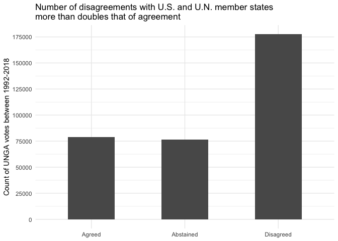<!-- -->

``` r
difference_bar(q4) +
  labs(
    title = 
      "Number of agreements between China and U.N. member states \n was about ten times that of disagreement",
    x = NULL,
    y = "Count of UNGA votes between 1992-2018"
  )
```

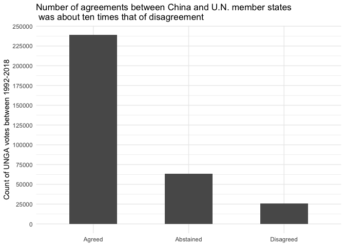<!-- -->

  - We notice how the number of disagreements with the United States and
    the United Nations member states more than doubles that of
    agreement. In the case of China, we observe how the number of
    agreements between China and U.N. member states was about ten times
    that of disagreement. Such a stark difference underscores how, among
    the United Nations member states, China is often viewed more
    favorably than the United States.

**Important Votes** - The United Nations dataset has a variable called
“importantvote.” This variable captures the votes identified as
important by the U.S. State Department report on Voting Practices in the
United Nations. The important votes for 2018 have not been yet reflected
in the dataset and hence been recorded as “NAs”.

**q6** How much percent of the votes in q1 are considered to be
“important”? What is the distribution of “difference” for “important”
votes in the case of the United States? What conclusions can be drawn?

``` r
q6 <-
  q1 %>%
  distinct(rcid, importantvote) %>%
  drop_na(importantvote) %>%
  count(importantvote == TRUE) %>%
  transmute(prop = n / sum(n))

q3 %>%
  filter(importantvote == TRUE) %>%
  ggplot(aes(difference)) +
  geom_bar(width = 0.5) +
  scale_y_continuous(
    breaks = scales::breaks_width(4000)
  ) +
  theme_minimal() +
  labs(
    title = 
      "Number of agreements between U.S. and U.N. member states \n almost matches that of disagreement in important votes",
    x = NULL,
    y =
      "Count of UNGA votes between 1992-2018\n classified as important by the U.S."
  )
```

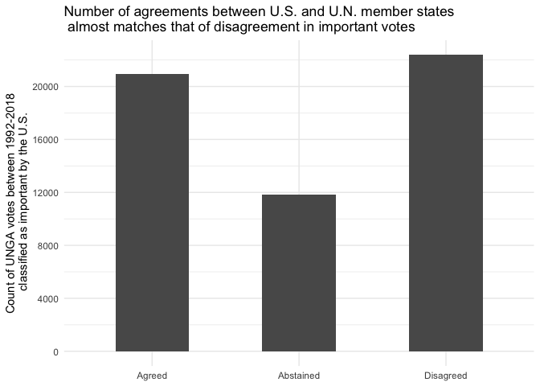<!-- -->

  - Around 17 percent of the votes were classified to be “important” by
    the U.S. State Department between 1992 and 2018.

  - Surprisingly, for votes classified as “important”, nations in
    agreement with the U.S. almost equalled that of disagreement. This
    may underscore how the U.S’s hegemnoic leadership in international
    regimes may be enforced through the U.S. securing supportive votes
    in resolutions that it considers to be vital or important.

**Visualization**

**q7** Visualize the “percentage of votes in agreement with the U.S.” on
a map. Do the same for China. What conclusions can you draw?

Hint: Making a function would simplify the process\!

``` r
agreement_map <- function(df, important, name)
  df %>%
  count(countryname, iso, difference) %>%
  pivot_wider(
    names_from = difference,
    values_from = n
  ) %>%
  rename_all(str_to_lower) %>%
  group_by(countryname, iso) %>%
  summarize(prop_agree = agreed / sum(agreed, abstained, disagreed)) %>%
  ungroup() %>%
  full_join(country_info %>% select(iso, geometry), by = "iso") %>%
  st_as_sf() %>%
  ggplot() +
  geom_sf(aes(fill = prop_agree), size = 0.01) +
  guides(
    fill = guide_colorbar(
      barheight = 0.5,
      barwidth = 15,
      title = NULL
    )
  ) +
  theme_void() +
  theme(
    legend.direction = "horizontal",
    legend.position = "bottom",
    plot.title = element_text(hjust = 0.5),
    plot.subtitle = element_text(hjust = 0.5)
  ) +
  labs(
    subtitle = 
      str_c("Percentage of ", important,"votes in agreement with ", name, " (1992-2018)"),
    caption = "Source: UNGA Voting Database"
  )
```

``` r
# Map for the United States
agreement_map(q3, "", "the U.S.") +
  scale_fill_gradientn(
    breaks = seq(0.1, 0.7, 0.1),
    labels = 
      c("10-%", "20%", "30%", "40%", "50%",
        "60%", "70+%"),
    colors = MAP_COLORS,
    na.value = MAP_NA_COLOR
  ) 
```

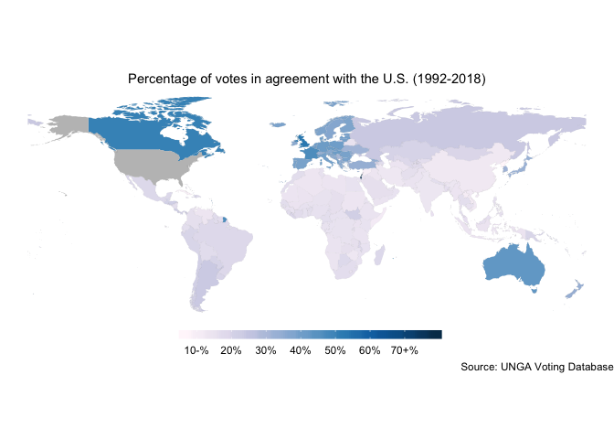<!-- -->

  - The map above indicates how only Israel, Canada, Australia, France
    and the UK were in relatively strong agreement with the United
    States in the United Nations General Assembly. Traditional United
    States’ allies including Korea, Japan, New Zealand, and European
    nations were positioned in the “middle ground” in terms of their
    voting alignment with the United States.

  - The rest of the world had low voting alignment percentage with the
    United States.

<!-- end list -->

``` r
# Map for China
agreement_map(q4, "", "China") +
  scale_fill_gradientn(
    breaks = seq(0.2, 0.9, 0.1),
    labels = 
      c("20%-", "30%", "40%", "50%",
        "60%", "70%", "80%", "90%+"),
    colors = MAP_COLORS,
    na.value = MAP_NA_COLOR
  )
```

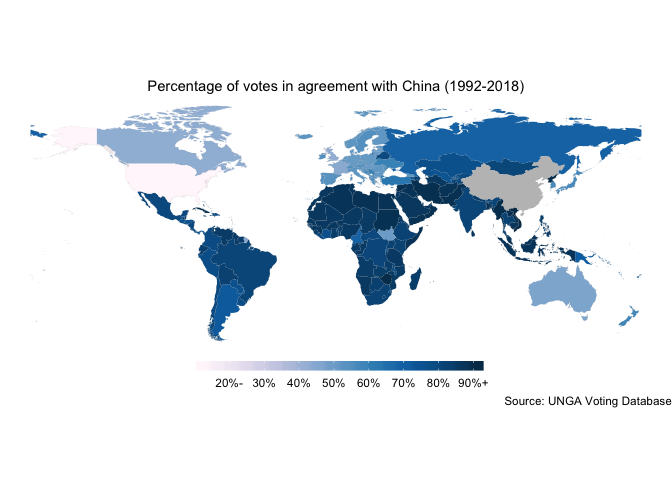<!-- -->

  - The map above indicates how only United States and Israel were in
    strong disagreement with China in their United Nations General
    Assembly voting pattern. Countries in Africa, Middle East, South
    East Asia, Latin Americ and Central Asia (alongside North Korea)
    strongly agreed with China. Some even displayed over a 90% alignment
    in votes.

  - Traditional United States’ allies including Korea, Japan, New
    Zealand, and Western European nations also had relatively “strong”
    alignment percentages with China.

**q8** Visualize the “percentage of votes in agreement with the U.S.”
for votes classified as important by the State Department on a map. Do
the same for China. What conclusions can you
draw?

``` r
agreement_map(q3 %>% filter(importantvote == TRUE), "important ", "the U.S.") +
  scale_fill_gradientn(
    breaks = seq(0.1, 0.8, 0.1),
    labels = 
      c("10%-", "20%", "30%", "40%", "50%",
        "60%", "70%", "80%+"),
    colors = MAP_COLORS,
    na.value = MAP_NA_COLOR
  )
```

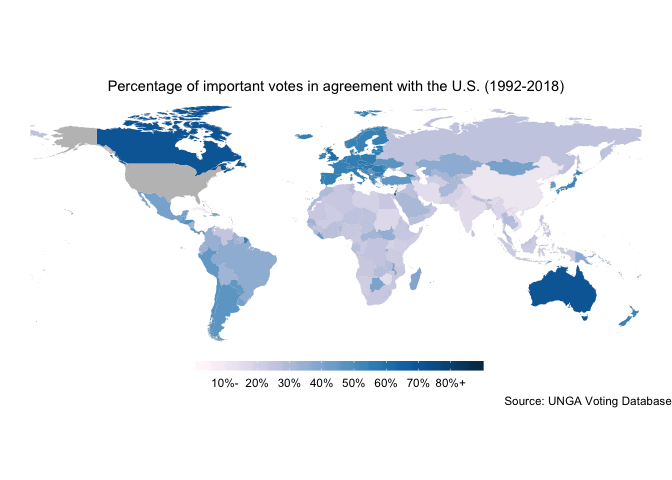<!-- -->

``` r
agreement_map(q4 %>% filter(importantvote == TRUE), "important ", "China") +
  scale_fill_gradientn(
    breaks = seq(0.2, 0.8, 0.1),
    labels = 
      c("20%-", "30%", "40%", "50%",
        "60%", "70%", "80%+"),
    colors = MAP_COLORS,
    na.value = MAP_NA_COLOR
  )
```

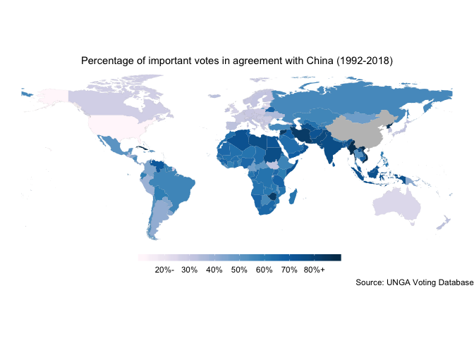<!-- -->

  - The maps above indicates how, for votes classified as “important” by
    the U.S. State Department, nations mostly increased in their voting
    alignment with the United States. Canada, Australia and Israel
    turned “dark blue” indicating their strong agreement in voting.
    United States’ allies such as Korea, Japan, and European nations
    also increased in their alignment percentage with the United States.
    Countries in South America, Africa and Central Asia also increased
    in their alignment with the United States. In the mean time, China
    remained to be in strong disagreement with the United States.

  - Such an increase in voting alignment further underlines how, while
    the nations may disagree with the United States, realist and
    constructivist alliance considerations compel them to vote in
    alignment with the hegemon on key resolutions.

<!-- end list -->

``` r
general <-
  q3 %>%
  count(countryname, iso, difference) %>%
  pivot_wider(
    names_from = difference,
    values_from = n
  ) %>%
  rename_all(str_to_lower) %>%
  group_by(countryname, iso) %>%
  summarize(prop_agree = agreed / sum(agreed, abstained, disagreed)) %>%
  ungroup()

important <-
  q3 %>%
  filter(importantvote == TRUE) %>%
  count(countryname, iso, difference) %>%
  pivot_wider(
    names_from = difference,
    values_from = n
  ) %>%
  rename_all(str_to_lower) %>%
  group_by(countryname, iso) %>%
  summarize(
    prop_agree_important = agreed / sum(agreed, abstained, disagreed)
  ) %>%
  ungroup()

general %>%
  left_join(
    important %>%  select(iso, prop_agree_important),
    by = "iso"
  ) %>%
  transmute(
    countryname,
    prop_increase = (prop_agree_important - prop_agree) / prop_agree
  ) %>%
  arrange(desc(prop_increase)) %>%
  top_n(10)
```

    ## Selecting by prop_increase

    ## # A tibble: 10 x 2
    ##    countryname           prop_increase
    ##    <chr>                         <dbl>
    ##  1 Timor-Leste                    2.21
    ##  2 El Salvador                    1.53
    ##  3 Peru                           1.31
    ##  4 Sao Tome and Principe          1.28
    ##  5 Belize                         1.27
    ##  6 Liberia                        1.27
    ##  7 Bahamas                        1.24
    ##  8 Paraguay                       1.23
    ##  9 Honduras                       1.22
    ## 10 Mexico                         1.22

``` r
general %>%
  left_join(
    important %>%  select(iso, prop_agree_important),
    by = "iso"
  ) %>%
  transmute(
    countryname,
    prop_increase = (prop_agree_important - prop_agree) / prop_agree
  ) %>%
  arrange(desc(prop_increase)) %>%
  top_n(-10)
```

    ## Selecting by prop_increase

    ## # A tibble: 10 x 2
    ##    countryname                                          prop_increase
    ##    <chr>                                                        <dbl>
    ##  1 France                                                      0.170 
    ##  2 United Kingdom of Great Britain and Northern Ireland        0.143 
    ##  3 Lao People's Democratic Republic                            0.118 
    ##  4 Israel                                                      0.116 
    ##  5 Russian Federation                                          0.0862
    ##  6 Viet Nam                                                    0.0771
    ##  7 China                                                      -0.0869
    ##  8 Syrian Arab Republic                                       -0.106 
    ##  9 Cuba                                                       -0.317 
    ## 10 Democratic People's Republic of Korea                      -0.534

  - We notice how except for four nations (China, Syria, Cuba and North
    Korea), all nations increased in their agreement percentage with the
    United States as the votes became classified as “important” by the
    State Department.

**U.S. and China Differs** (Optional)

**q9** Consider the resolutions where the U.S. and China had opposing
votes.

Which voting option did each nation “lean most favorably towards” over
1992-2018? Was there any difference for votes classified as “important”?

``` r
us_china_diff <-
  q3 %>%
  filter(iso == "chn", difference == "Disagreed") %>%
  #  filter_at(vars(me, nu, di, co, hr, ec), all_vars(. == FALSE)) %>%
  pull(rcid)

us_china_map <- function(df)
  df %>%    
  filter(
    rcid %in% us_china_diff, 
    iso != "chn"
  ) %>%
  count(iso, difference) %>%
  pivot_wider(
    names_from = difference,
    values_from = n
  ) %>%
  rename_all(str_to_lower) %>%
  group_by(iso) %>%
  mutate(
    America = replace_na(agreed, 0),
    China = replace_na(disagreed, 0),
    Abstained = replace_na(abstained, 0),
    sum = sum(America, Abstained, China)
  ) %>%
  summarize_at(vars(America, Abstained, China), ~ . / sum) %>%
  group_by(iso) %>%
  mutate(
    top_prop = 
      c("America", "Abstained", "China")
        [which.max(c(America, Abstained, China))]
  ) %>%
  ungroup()


country_info %>%
  left_join(us_china_map(q3), by = "iso") %>%
  st_as_sf() %>%
  ggplot() +
  geom_sf(aes(fill = top_prop), size = 0.01) +
  theme_void() +
  labs(
    title =
      "Most voted option when U.S. and China had opposing votes (1992-2018)",
    fill = NULL
  )
```

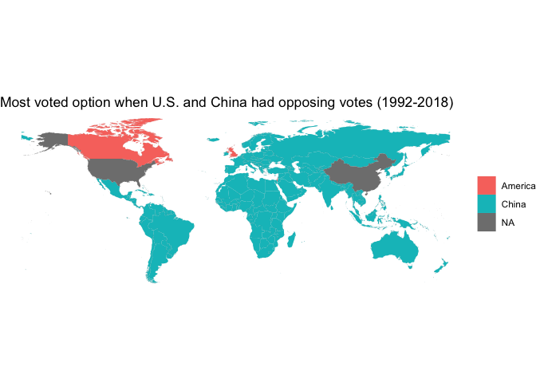<!-- -->

``` r
country_info %>%
  left_join(
    us_china_map(q3 %>% filter(importantvote == TRUE)), by = "iso"
  ) %>%
  st_as_sf() %>%
  ggplot() +
  geom_sf(aes(fill = top_prop), size = 0.01) +
  theme_void() +
  labs(
    title =
      "Most voted option when U.S. and China had opposing votes (1992-2018)",
    subtitle = "Votes that the U.S. State Department classified as important",
    fill = NULL
  )
```

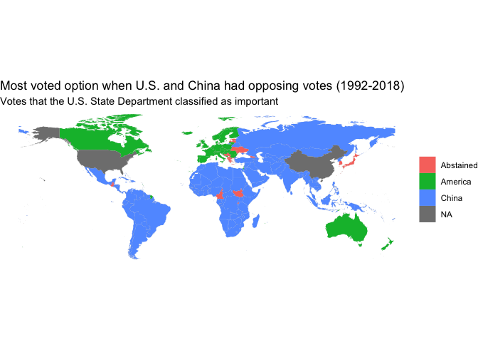<!-- -->

**q10** Finally, the democracy and income variables on to the map. Are
there any possible correlations?

``` r
country_info %>%
  st_as_sf() %>%
  ggplot() +
  geom_sf(aes(fill = electoral_democracy), size = 0.01) +
  theme_void() +
  labs(
    fill = "Electoral Democracy?",
    subtitle = "Map of Electoral Democracies as of 2019",
    caption = "Source: Freedom House"
  )
```

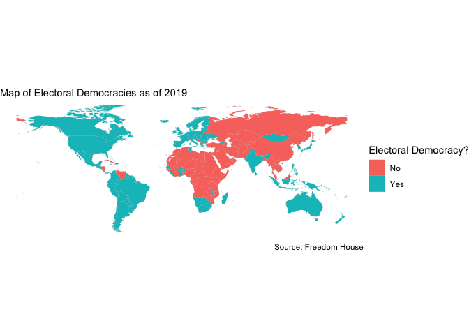<!-- -->

``` r
country_info %>%
  st_as_sf() %>%
  ggplot() +
  geom_sf(aes(fill = income_grp), size = 0.01) +
  theme_void() +
  labs(
    fill = "Income Level",
    subtitle = "Map of Nation's Income Levels",
    caption = "Source: Gapminder Data"
  )
```

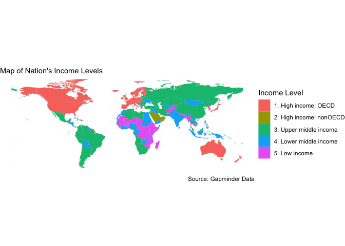<!-- -->

  - Democratic and high-income nations (Canada, Europe, Australia, New
    Zealand, Israel, Korea, Japan) were likely to vote in alignment with
    the United States.

  - Non-democracies were likely to vote in alignment with China. So were
    middle income nations such as Brazil, India South Africa, Indonesia,
    Mexico, and Egypt.

## Answers

To create an RDS file with answers, save all of your solutions in
variables such as `q1`, `q2.1`, etc. The following code will create an
answer file when you knit the solution.Rmd file. You specify where the
answer file is saved using the `file_answers` variable in the
parameters.

To provide answers, set `eval=TRUE` in the chunk below. If you will not
be providing answers, simply delete the following lines.

Save answers.

``` r
if (SAVE_ANSWERS) {
  ls(pattern = "^q[1-9][0-9]*(\\.[1-9][0-9]*)*$") %>%
    str_sort(numeric = TRUE) %>% 
    set_names() %>% 
    map(get) %>%
    discard(is.ggplot) %>%
    write_rds(file_answers)
}
```
